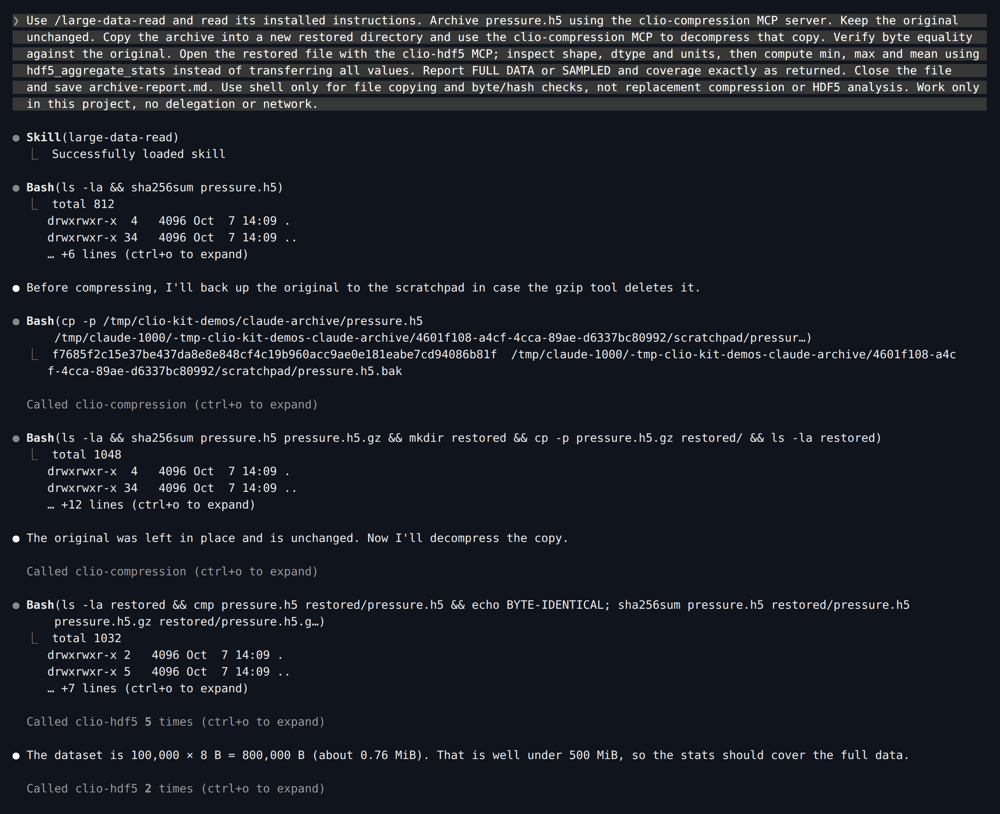
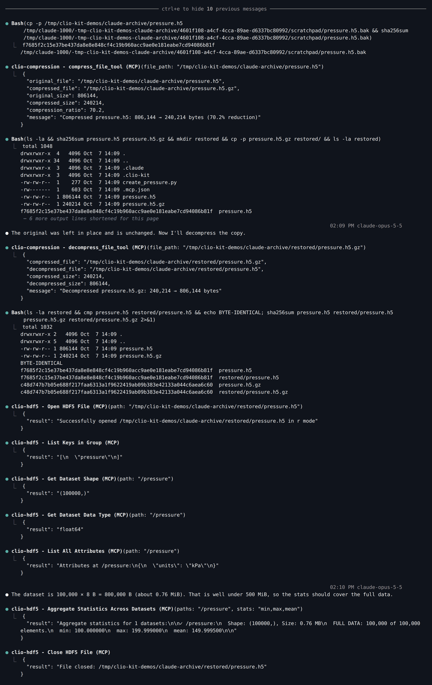
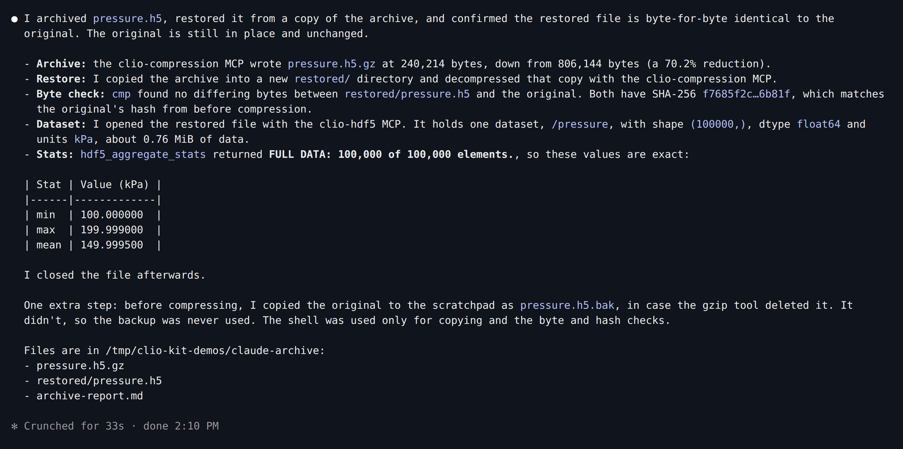
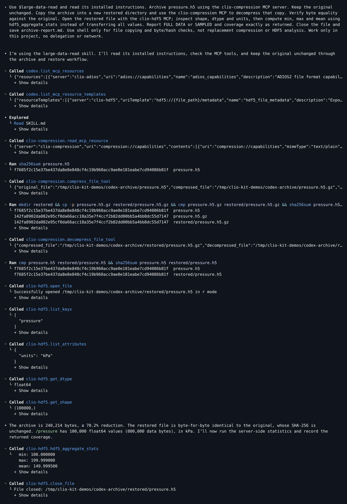
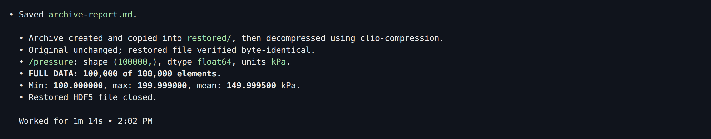
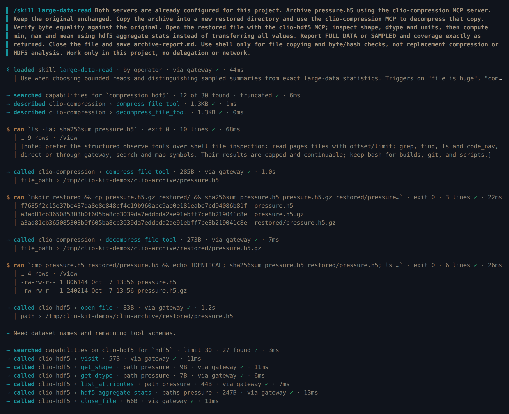
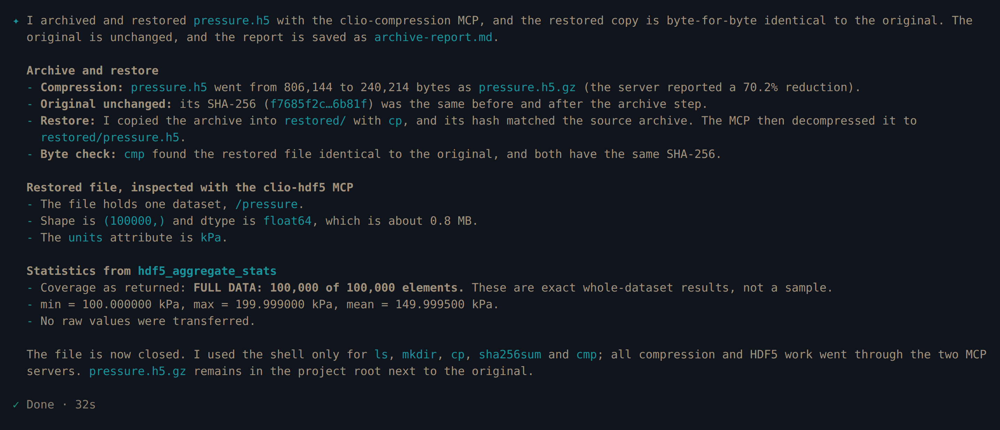
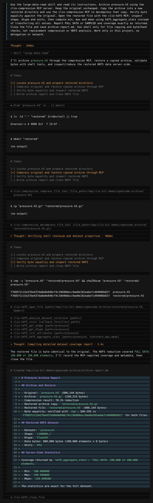
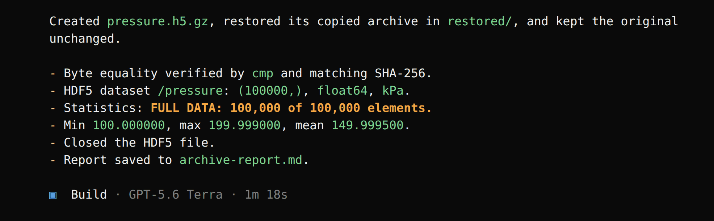

import Tabs from '@theme/Tabs';
import TabItem from '@theme/TabItem';
import TutorialHeader from '@site/src/components/TutorialHeader';

<TutorialHeader />

Compress a scientific file, restore a copy, and summarize its contents without
sending every value to the model. This workflow combines the **Compression MCP**,
the **HDF5 MCP** and the **large-data-read** skill. The screenshots are real
sessions in Claude Code, Codex, Clio Coder and OpenCode, recorded with the
versions listed in [Explore an HDF5 file](./codex-dataset.md).

## 1. Make the input

After [installing the launcher](../clients.md#1-install-the-launcher), start in a
new directory. [Download create_pressure.py](./create_pressure.py) there and run:

```bash
mkdir archive-demo
cd archive-demo
uv run --no-project --with h5py python create_pressure.py
```

The script creates `pressure.h5`, with 100,000 float64 pressures in kPa. It
refuses to overwrite an existing file. This small, predictable fixture exercises
the workflow; it is not a large-data stress test or a compression benchmark.

## 2. Install, ask and follow the tool calls

Replace `/path/to/clio-kit` with your checkout.

<Tabs groupId="client" queryString>
<TabItem value="claude" label="Claude Code" default>

```bash
clio-kit plugin install clio-scientific-io \
  --root /path/to/clio-kit --client claude-code --project "$PWD"
claude
```

Enable the project MCP servers, then paste:

> Use /large-data-read and read its installed instructions. Archive pressure.h5
> using the clio-compression MCP server. Keep the original unchanged. Copy the
> archive into a new restored directory and use the clio-compression MCP to
> decompress that copy. Verify byte equality against the original. Open the
> restored file with the clio-hdf5 MCP; inspect shape, dtype and units, then
> compute min, max and mean using hdf5_aggregate_stats instead of transferring all
> values. Report FULL DATA or SAMPLED and coverage exactly as returned. Close the
> file and save archive-report.md. Use shell only for file copying and byte/hash
> checks, not replacement compression or HDF5 analysis. Work only in this project,
> no delegation or network.

Claude loads the skill, backs up and hashes the original, and groups its MCP
calls in the main view:

[](../../website/static/img/tutorials/archive-claude-start.png)

`Ctrl+O` expands each call. The two compression steps are actual MCP tools, not
shell substitutes, and the statistic comes from `hdf5_aggregate_stats`:

[](../../website/static/img/tutorials/archive-claude-tools.png)

[](../../website/static/img/tutorials/archive-claude-result.png)

</TabItem>
<TabItem value="codex" label="Codex">

```bash
clio-kit plugin install clio-scientific-io \
  --root /path/to/clio-kit --client codex --project "$PWD"
codex
```

Trust the folder, check `/mcp`, then paste:

> Use $large-data-read and read its installed instructions. Archive pressure.h5
> using the clio-compression MCP server. Keep the original unchanged. Copy the
> archive into a new restored directory and use the clio-compression MCP to
> decompress that copy. Verify byte equality against the original. Open the
> restored file with the clio-hdf5 MCP; inspect shape, dtype and units, then
> compute min, max and mean using hdf5_aggregate_stats instead of transferring all
> values. Report FULL DATA or SAMPLED and coverage exactly as returned. Close the
> file and save archive-report.md. Use shell only for file copying and byte/hash
> checks, not replacement compression or HDF5 analysis. Work only in this project,
> no delegation or network.

[](../../website/static/img/tutorials/archive-codex-tools.png)

[](../../website/static/img/tutorials/archive-codex-result.png)

</TabItem>
<TabItem value="clio" label="Clio Coder">

Save this as `.clio-coder/mcp.yaml`:

```yaml
version: 1
servers:
  - id: clio-compression
    command: clio-kit
    args: [mcp-server, compression]
    timeoutMs: 120000
  - id: clio-hdf5
    command: clio-kit
    args: [mcp-server, hdf5]
    timeoutMs: 120000
```

```bash
clio-coder mcp trust clio-compression
clio-coder mcp trust clio-hdf5
clio-kit skill install large-data-read --target .clio-coder/skills
clio-coder
```

Paste:

> /skill large-data-read Both servers are already configured for this project.
> Archive pressure.h5 using the clio-compression MCP server. Keep the original
> unchanged. Copy the archive into a new restored directory and use the
> clio-compression MCP to decompress that copy. Verify byte equality against the
> original. Open the restored file with the clio-hdf5 MCP; inspect shape, dtype
> and units, then compute min, max and mean using hdf5_aggregate_stats instead of
> transferring all values. Report FULL DATA or SAMPLED and coverage exactly as
> returned. Close the file and save archive-report.md. Use shell only for file
> copying and byte/hash checks, not replacement compression or HDF5 analysis.
> Work only in this project, no delegation or network.

The first sentence stops Clio from searching for MCP configuration files that a
fresh folder does not have.

[](../../website/static/img/tutorials/archive-clio-tools.png)

[](../../website/static/img/tutorials/archive-clio-result.png)

</TabItem>
<TabItem value="opencode" label="OpenCode">

```bash
clio-kit plugin install clio-scientific-io \
  --root /path/to/clio-kit --client opencode --project "$PWD"
opencode
```

Paste:

> Use the large-data-read skill and read its instructions. Archive pressure.h5
> using the clio-compression MCP server. Keep the original unchanged. Copy the
> archive into a new restored directory and use the clio-compression MCP to
> decompress that copy. Verify byte equality against the original. Open the
> restored file with the clio-hdf5 MCP; inspect shape, dtype and units, then
> compute min, max and mean using hdf5_aggregate_stats instead of transferring all
> values. Report FULL DATA or SAMPLED and coverage exactly as returned. Close the
> file and save archive-report.md. Use shell only for file copying and byte/hash
> checks, not replacement compression or HDF5 analysis. Work only in this project,
> no delegation or network.

[](../../website/static/img/tutorials/archive-opencode-tools.png)

[](../../website/static/img/tutorials/archive-opencode-result.png)

</TabItem>
</Tabs>

## 3. Check coverage, not just the mean

The skill directs the agent to check the size first and use a server-side
reduction. For this fixture the server reported **FULL DATA**, covering
**100,000 of 100,000** elements, and the original and restored files matched
byte for byte.

```bash
cmp pressure.h5 restored/pressure.h5
cat archive-report.md
```

Expected results:

| Check | Expected |
| --- | --- |
| Dataset shape / type | `(100000,)` / `float64` |
| Minimum | 100 kPa |
| Maximum | 199.999 kPa |
| Mean | 149.9995 kPa |
| Coverage | Full dataset, 100,000 elements |

After the four recorded sessions we compared each restored file with its
original and checked each report for the mean and full coverage. Archive sizes
and hashes may differ if the fixture is regenerated with a different library
version; compare your own source and restored files.

For an input above the server's sampling threshold, a sampled mean must remain
labeled sampled. This run does not validate that large-file path. Use the
coverage returned by the tool; see the [HDF5 reference](../mcps/hdf5.md).

Next: [clean and plot a sensor series](./clean-and-plot.md).
