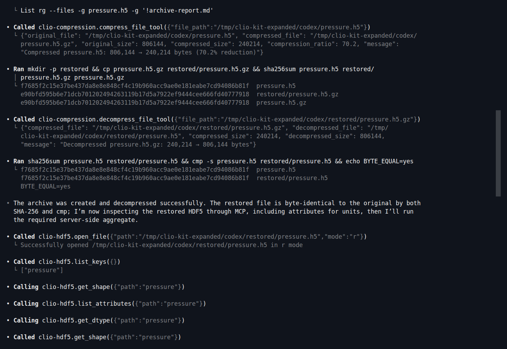
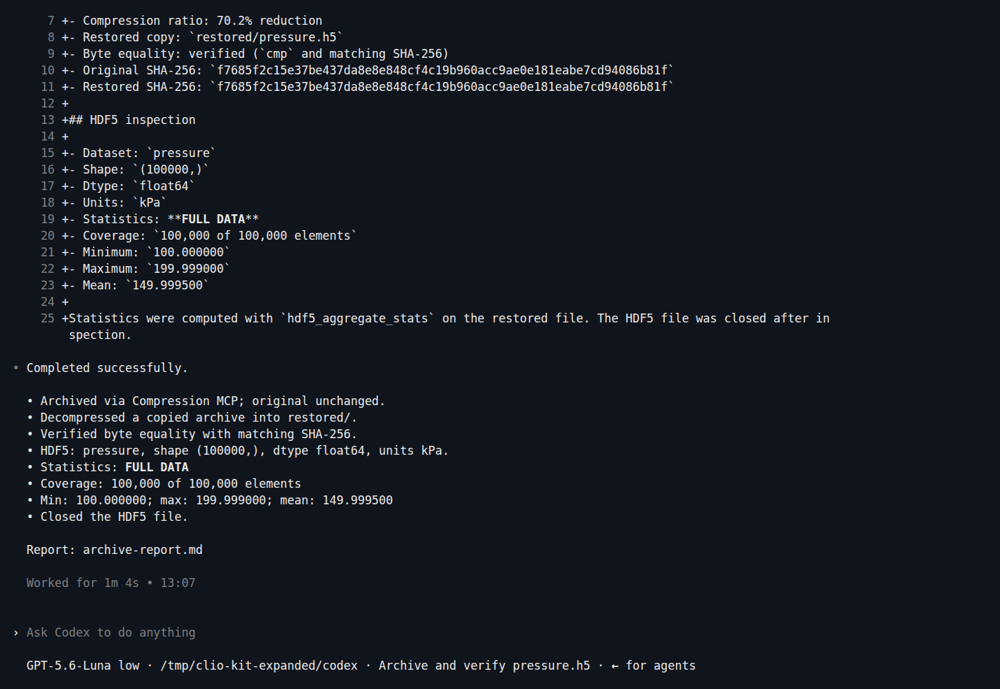

Compress a scientific file, restore a copy, and summarize its contents without
sending every value to the model. This workflow combines the **Compression MCP**,
**HDF5 MCP** and **large-data-read** skill. The screenshots are from Codex CLI
0.159.2 with GPT-5.6-Luna using the actual servers.

## 1. Install the workflow and make the input

After [installing the launcher](../clients.md#1-install-the-launcher), start in a
new directory. Replace `/path/to/clio-kit` with your checkout:

```bash
mkdir archive-demo
cd archive-demo
clio-kit plugin install clio-scientific-io \
  --root /path/to/clio-kit --client codex --project "$PWD"
```

[Download create_pressure.py](./create_pressure.py) here and run:

```bash
uv run --no-project --with h5py python create_pressure.py
```

The script creates `pressure.h5`, with 100,000 float64 pressures in kPa. It refuses
to overwrite an existing file. This small, predictable fixture exercises the
workflow; it is not a large-data stress test or a compression benchmark.

## 2. Ask Codex to use both MCPs

Start `codex`, trust the project, check `/mcp`, and paste:

> Use $large-data-read and read its installed instructions. Archive pressure.h5
> using the Compression MCP. Keep the original unchanged. Copy the archive into
> a new restored directory and use the Compression MCP to decompress that copy.
> Verify byte equality against the original. Open the restored file with HDF5
> MCP; inspect shape, dtype and units, then compute min, max and mean using
> hdf5_aggregate_stats instead of transferring all values. Report FULL DATA or
> SAMPLED and coverage exactly as returned. Close the file and save
> archive-report.md. Use shell only for file copying and byte/hash checks, not
> replacement compression or HDF5 analysis. Work only in this project, no
> delegation or network.

Approve the intended operations in this disposable directory. The two compression
calls below are actual MCP tools, not shell substitutes:

[](../../website/static/img/tutorials/archive-tools.png)

## 3. Check coverage, not just the mean

The skill directs the agent to inspect size and use a server-side reduction.
For this fixture, the server reported **FULL DATA**, covering **100,000 of 100,000**
elements. The original and restored files matched byte-for-byte.

[](../../website/static/img/tutorials/archive-result.png)

```bash
cmp pressure.h5 restored/pressure.h5
cat archive-report.md
```

Expected results:

| Check | Expected |
| --- | --- |
| Dataset shape / type | `(100000,)` / `float64` |
| Minimum | 100 kPa |
| Maximum | 199.999 kPa |
| Mean | 149.9995 kPa |
| Coverage | Full dataset, 100,000 elements |

We independently read all values with h5py and checked the statistics and byte
equality after the agent finished. Archive sizes and hashes may differ if the
fixture is regenerated with a different library version; compare your own source
and restored files.

For an input above the server's sampling threshold, a sampled mean must remain
labeled sampled. This run does not validate that large-file path. Use the coverage
returned by the tool; see the [HDF5 reference](../mcps/hdf5.md).

Next: [clean and plot a sensor series](./clean-and-plot.md).
