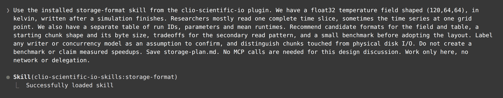
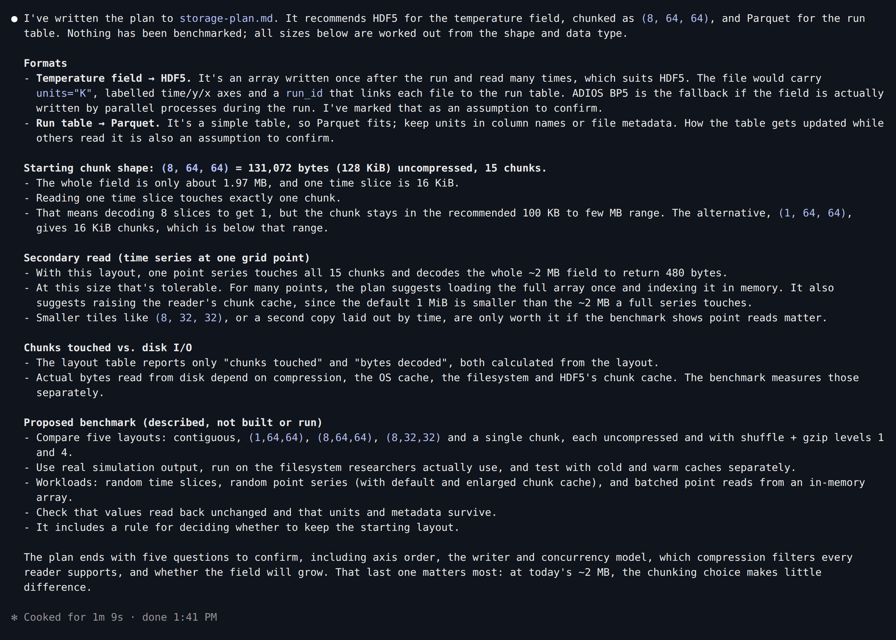
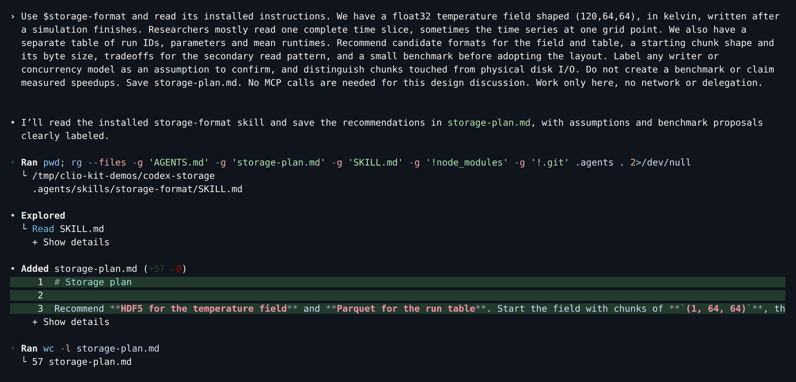
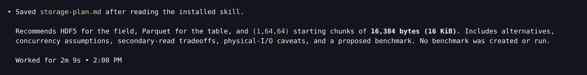
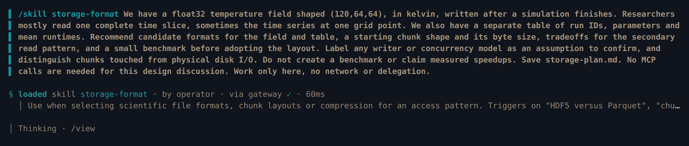
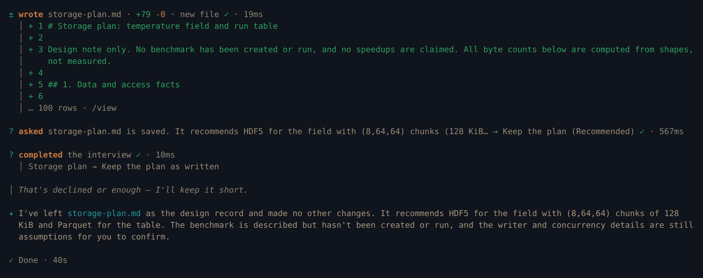
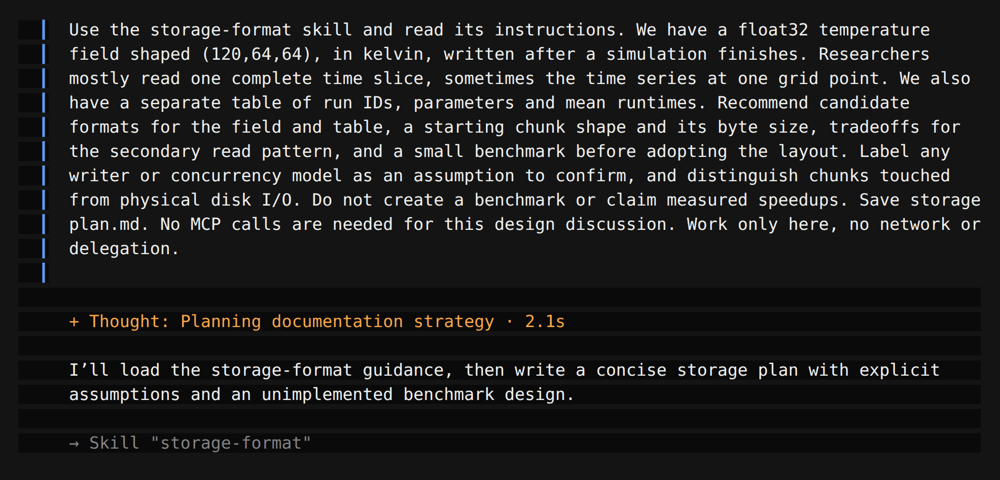
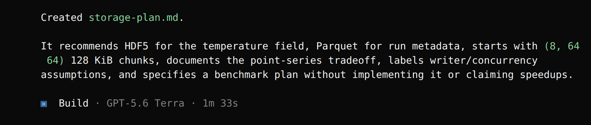

import Tabs from '@theme/Tabs';
import TabItem from '@theme/TabItem';
import TutorialHeader from '@site/src/components/TutorialHeader';

<TutorialHeader />

Some skills provide domain guidance without calling an MCP. Here
**storage-format** structures a format and chunk-layout discussion. The result is
a plan, not a benchmark. The screenshots are real sessions in Claude Code, Codex,
Clio Coder and OpenCode, recorded with the versions listed in
[Explore an HDF5 file](./codex-dataset.md).

## 1. Install the skill

Install the [CLIO Kit launcher](../clients.md#1-install-the-launcher) first and
work in a new folder. Claude Code can take the skill from the native
**clio-scientific-io** plugin; the other clients use the portable skill folder.

## 2. Describe the data and access pattern

The request is the same in every client apart from how the skill is invoked. It
asks the agent to label assumptions and to keep chunks touched separate from
physical disk I/O, two points that are easy to blur in a design discussion.

<Tabs groupId="client" queryString>
<TabItem value="claude" label="Claude Code" default>

```bash
claude plugin marketplace add /path/to/clio-kit
claude plugin install clio-scientific-io@clio-kit --scope project
claude
```

[](../../website/static/img/tutorials/native-install.png)

The plugin also configures MCP servers, but **this discussion uses no MCP
tools**. To install only the skill, use
`clio-kit skill install storage-format --target .claude/skills`. Ask:

> Use the installed storage-format skill from the clio-scientific-io plugin. We
> have a float32 temperature field shaped (120,64,64), in kelvin, written after a
> simulation finishes. Researchers mostly read one complete time slice, sometimes
> the time series at one grid point. We also have a separate table of run IDs,
> parameters and mean runtimes. Recommend candidate formats for the field and
> table, a starting chunk shape and its byte size, tradeoffs for the secondary
> read pattern, and a small benchmark before adopting the layout. Label any writer
> or concurrency model as an assumption to confirm, and distinguish chunks touched
> from physical disk I/O. Do not create a benchmark or claim measured speedups.
> Save storage-plan.md. No MCP calls are needed for this design discussion. Work
> only here, no network or delegation.

Claude loads `clio-scientific-io-skills:storage-format`. That is the client's
native plugin prefix; the portable skill is named `storage-format`.

[](../../website/static/img/tutorials/storage-claude-tools.png)

[](../../website/static/img/tutorials/storage-claude-result.png)

</TabItem>
<TabItem value="codex" label="Codex">

```bash
clio-kit skill install storage-format --target .agents/skills
codex
```

Ask:

> Use $storage-format and read its installed instructions. We have a float32
> temperature field shaped (120,64,64), in kelvin, written after a simulation
> finishes. Researchers mostly read one complete time slice, sometimes the time
> series at one grid point. We also have a separate table of run IDs, parameters
> and mean runtimes. Recommend candidate formats for the field and table, a
> starting chunk shape and its byte size, tradeoffs for the secondary read
> pattern, and a small benchmark before adopting the layout. Label any writer or
> concurrency model as an assumption to confirm, and distinguish chunks touched
> from physical disk I/O. Do not create a benchmark or claim measured speedups.
> Save storage-plan.md. No MCP calls are needed for this design discussion. Work
> only here, no network or delegation.

[](../../website/static/img/tutorials/storage-codex-tools.png)

[](../../website/static/img/tutorials/storage-codex-result.png)

</TabItem>
<TabItem value="clio" label="Clio Coder">

```bash
clio-kit skill install storage-format --target .clio-coder/skills
clio-coder
```

Ask:

> /skill storage-format We have a float32 temperature field shaped (120,64,64),
> in kelvin, written after a simulation finishes. Researchers mostly read one
> complete time slice, sometimes the time series at one grid point. We also have
> a separate table of run IDs, parameters and mean runtimes. Recommend candidate
> formats for the field and table, a starting chunk shape and its byte size,
> tradeoffs for the secondary read pattern, and a small benchmark before adopting
> the layout. Label any writer or concurrency model as an assumption to confirm,
> and distinguish chunks touched from physical disk I/O. Do not create a
> benchmark or claim measured speedups. Save storage-plan.md. No MCP calls are
> needed for this design discussion. Work only here, no network or delegation.

After writing the plan, Clio asked whether to keep it; the recording answered
with its recommended option, **Keep the plan**.

[](../../website/static/img/tutorials/storage-clio-tools.png)

[](../../website/static/img/tutorials/storage-clio-result.png)

</TabItem>
<TabItem value="opencode" label="OpenCode">

```bash
clio-kit skill install storage-format --target .agents/skills
opencode
```

Ask:

> Use the storage-format skill and read its instructions. We have a float32
> temperature field shaped (120,64,64), in kelvin, written after a simulation
> finishes. Researchers mostly read one complete time slice, sometimes the time
> series at one grid point. We also have a separate table of run IDs, parameters
> and mean runtimes. Recommend candidate formats for the field and table, a
> starting chunk shape and its byte size, tradeoffs for the secondary read
> pattern, and a small benchmark before adopting the layout. Label any writer or
> concurrency model as an assumption to confirm, and distinguish chunks touched
> from physical disk I/O. Do not create a benchmark or claim measured speedups.
> Save storage-plan.md. No MCP calls are needed for this design discussion. Work
> only here, no network or delegation.

[](../../website/static/img/tutorials/storage-opencode-tools.png)

[](../../website/static/img/tutorials/storage-opencode-result.png)

</TabItem>
</Tabs>

## 3. Review the recommendation

All four sessions proposed HDF5 for the field and Parquet for the separate run
table, and each labeled its writer model as an assumption. They chose different
starting chunks:

| Candidate | Calculation | Size | Recommended by |
| --- | --- | --- | --- |
| One time slice | `1 × 64 × 64 × 4` | 16,384 bytes / 16 KiB | Codex |
| Eight time slices | `8 × 64 × 64 × 4` | 131,072 bytes / 128 KiB | Claude Code, Clio Coder, OpenCode |

We checked that arithmetic in each saved plan. It does not establish which
candidate is faster: one slice per chunk reads exactly one chunk for the primary
pattern but many small chunks for a point time series, while eight slices
reduce the chunk count at the cost of reading more than one slice. The number of
chunks touched is not a measured count of disk operations; caching and storage
layout decide that.

## 4. Keep the plan separate from evidence

```bash
cat storage-plan.md
```

Before adopting a layout, confirm the writer model, consumer support and metadata
requirements. Benchmark both access patterns on your target filesystem with
representative data. These sessions did not run that benchmark. The skill
helped frame the discussion; reviewing the model's assumptions is still
necessary.
