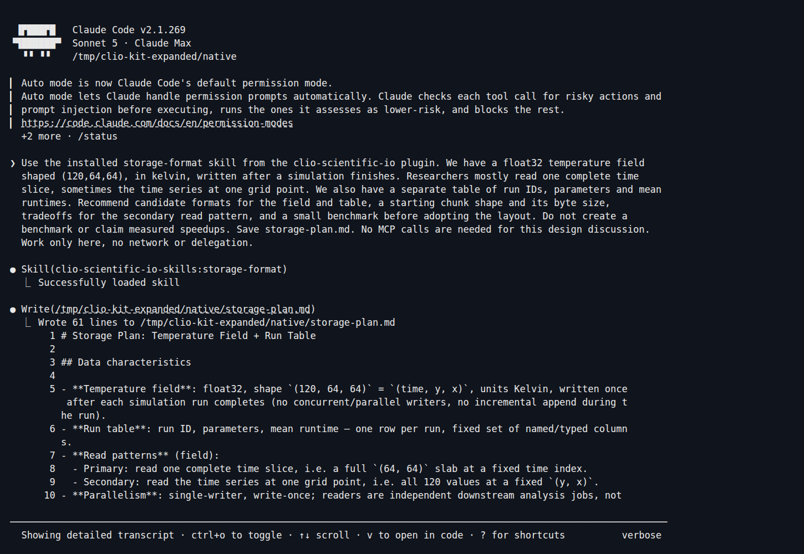
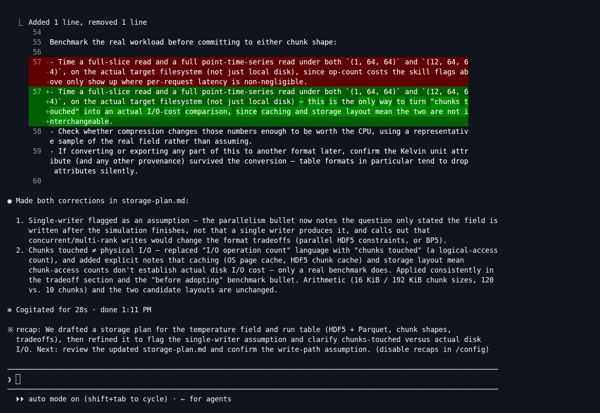

Some skills provide domain guidance without calling an MCP. Here **storage-format**
helps structure a format and chunk-layout discussion. This is a real Claude Code
2.1.269 / Sonnet 5 session using a skill installed through a **native plugin**.
It produces a plan, not a benchmark result.

## 1. Install the native workflow plugin

Install the [CLIO Kit launcher](../clients.md#1-install-the-launcher) first. From
your working project, register the checkout and install the plugin:

```bash
claude plugin marketplace add /path/to/clio-kit
claude plugin install clio-scientific-io@clio-kit --scope project
```

[](../../clio-kit-website/static/img/tutorials/native-install.png)

The workflow includes the scientific I/O skill package. It also configures MCPs,
but **this discussion uses no MCP tools**. If you only want the skill, install
`storage-format` into `.claude/skills` instead; see [installation routes](./install-components.md).

## 2. Describe the data and access pattern

Start a fresh `claude` session and ask:

> Use the installed storage-format skill from the clio-scientific-io plugin. We
> have a float32 temperature field shaped (120,64,64), in kelvin, written after a
> simulation finishes. Researchers mostly read one complete time slice, sometimes
> the time series at one grid point. We also have a separate table of run IDs,
> parameters and mean runtimes. Recommend candidate formats for the field and
> table, a starting chunk shape and its byte size, tradeoffs for the secondary
> read pattern, and a small benchmark before adopting the layout. Do not create a
> benchmark or claim measured speedups. Save storage-plan.md. No MCP calls are
> needed for this design discussion. Work only here, no network or delegation.

Claude loaded `clio-scientific-io-skills:storage-format`. That is the client’s
native plugin prefix; the portable skill is named `storage-format`.

[](../../clio-kit-website/static/img/tutorials/storage-skill.png)

## 3. Review the recommendation

The session proposed HDF5 for the field and Parquet for the separate run table.
It compared these uncompressed chunk sizes:

| Candidate | Calculation | Size |
| --- | --- | --- |
| One time slice | `1 × 64 × 64 × 4` | 16,384 bytes / 16 KiB |
| Twelve slices | `12 × 64 × 64 × 4` | 196,608 bytes / 192 KiB |

We checked that arithmetic. It does not establish which candidate is faster.
The first response also inferred a single writer and equated chunks touched with
physical I/O operations. We asked for an explicit correction:

> Label single-writer as an assumption to confirm. Distinguish chunks touched or
> decompressed from physical disk I/O operations; caching and storage layout mean
> the number of chunks does not establish a measured I/O count. Keep the candidate
> layouts and arithmetic, with no claimed measurements.

[](../../clio-kit-website/static/img/tutorials/storage-review.png)

## 4. Keep the plan separate from evidence

```bash
cat storage-plan.md
```

Before adopting a layout, confirm the writer model, consumer support and metadata
requirements. Benchmark both access patterns on your target filesystem with
representative data. This tutorial did not run that benchmark. The skill helped
frame the discussion; reviewing the model's assumptions was still necessary.

For Codex, install the same portable skill to `.agents/skills` and request
`$storage-format`. The native-plugin session shown here was run in Claude Code.
