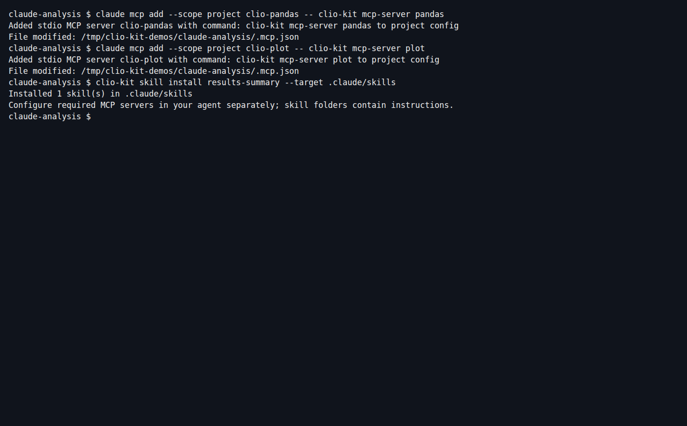
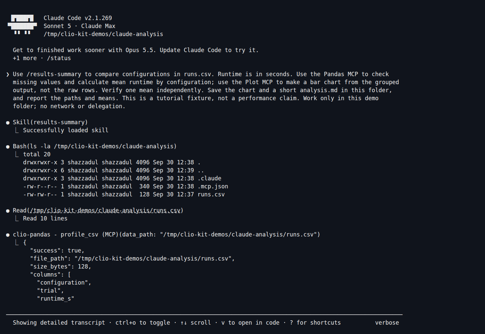
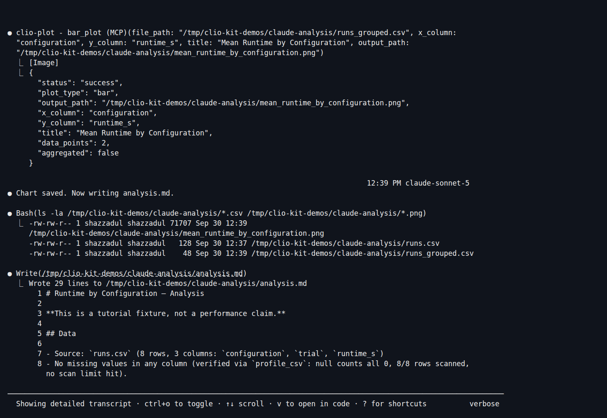
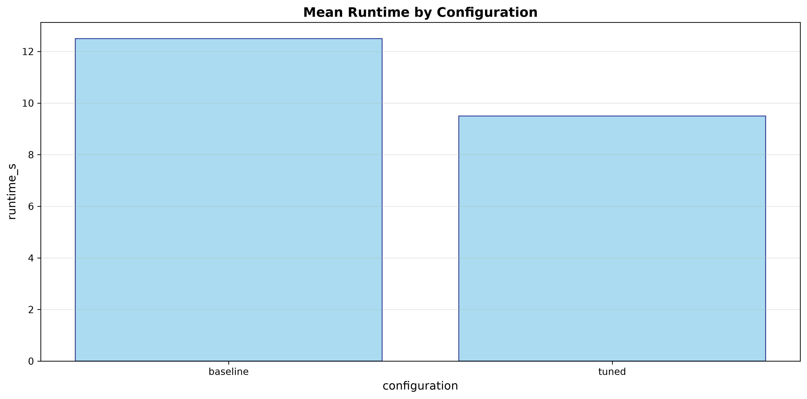
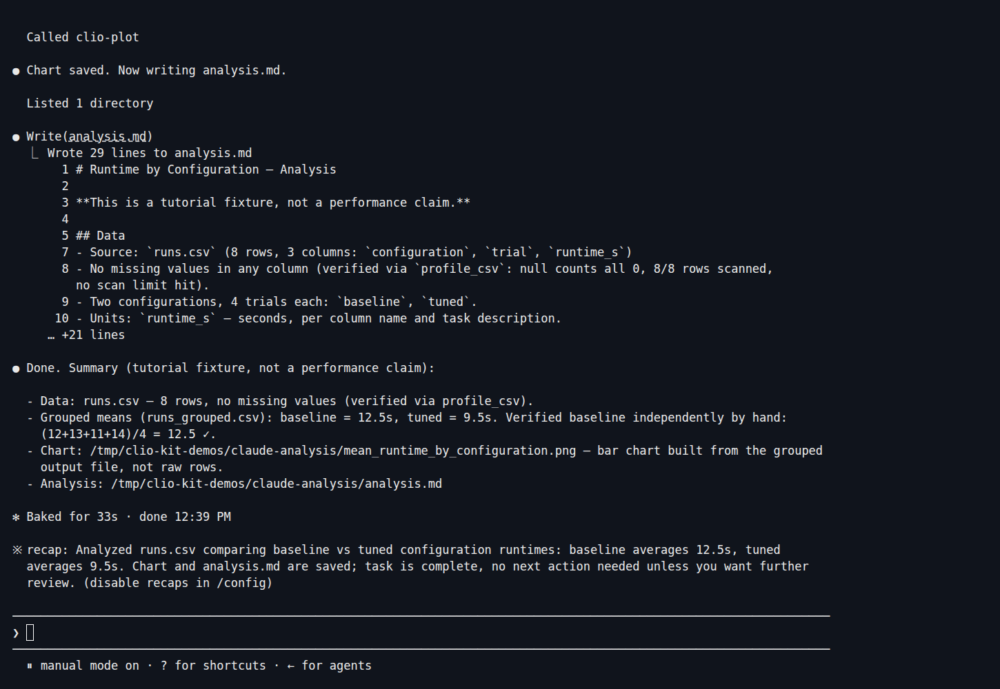

Give Claude Code a CSV of experiment runs and ask it to compare configurations.
You will install **Pandas** and **Plot** MCP servers, add the **results-summary**
skill, and produce a grouped CSV, a bar chart and a short analysis.

The screenshots show a real Claude Code session (2.1.269, Sonnet 5). The eight
rows are a tutorial fixture, not evidence of a real system's performance.

## 1. Connect the tools and install the skill

Start with the [CLIO Kit launcher](../clients.md#1-install-the-launcher) installed
from your checkout and Claude Code signed in. In a new project:

```bash
mkdir claude-analysis
cd claude-analysis
claude mcp add --scope project clio-pandas -- clio-kit mcp-server pandas
claude mcp add --scope project clio-plot -- clio-kit mcp-server plot
clio-kit skill install results-summary --target .claude/skills
```

The two MCP entries go in `.mcp.json`; the skill goes in
`.claude/skills/results-summary/`. The skill explains how to pass transformed
data between these tools. It does not configure either MCP by itself.

[](../../website/static/img/tutorials/claude-install.png)

## 2. Add the experiment results

[Download runs.csv](./runs.csv) into the project, or save this as `runs.csv`:

```csv
configuration,trial,runtime_s
baseline,1,12
baseline,2,13
baseline,3,11
baseline,4,14
tuned,1,9
tuned,2,10
tuned,3,8
tuned,4,11
```

Each row is one trial, and `runtime_s` is elapsed time in seconds.

## 3. Start Claude Code

```bash
claude
```

Trust this project and enable the two intended MCP servers when prompted.
Check `/mcp` before continuing. Then ask:

> Use /results-summary to compare configurations in runs.csv. Runtime is in
> seconds. Use the Pandas MCP to check missing values and calculate mean runtime
> by configuration; use the Plot MCP to make a bar chart from the grouped output,
> not the raw rows. Verify one mean independently. Save the chart and a short
> analysis.md in this folder, and report the paths and means. This is a tutorial
> fixture, not a performance claim. Work only in this demo folder; no network
> or delegation.

Approve the intended tool calls and output files in the demo directory. Claude
loads the skill before working with the table:

[](../../website/static/img/tutorials/claude-working.png)

## 4. Watch the handoff between tools

In this run, Pandas checked missing values and grouped the rows by configuration.
The result was saved as `runs_grouped.csv`. Claude passed **that file** to Plot's
`bar_plot`, as shown in the expanded tool call:

[](../../website/static/img/tutorials/claude-tools.png)

This is why the skill matters: the plotting server reads a file, not an in-memory
Pandas result. Plotting the original CSV would skip the aggregation you asked for.
You can expand Claude's transcript with `Ctrl+O` to inspect tool arguments.

## 5. Open the outputs and verify the numbers

```bash
cat runs_grouped.csv
cat analysis.md
```

The grouped file should contain:

```csv
configuration,runtime_s
baseline,12.5
tuned,9.5
```

Check the means yourself: `(12 + 13 + 11 + 14) / 4 = 12.5` seconds;
`(9 + 10 + 8 + 11) / 4 = 9.5` seconds. We also independently recomputed both
means from the source CSV after this session and compared them with the saved
MCP output.

Here is the actual image produced by the Plot MCP:

[](../../website/static/img/tutorials/runtime-chart.png)

The captured session saved it as `mean_runtime_by_configuration.png`. Your agent
may choose a different name; open the path it actually reports. Check the units,
categories and heights, not only whether the image exists.

[](../../website/static/img/tutorials/claude-result.png)

*Select screenshots to enlarge them. These are captures of the actual terminal
session; the chart is its generated artifact.*

If a tool is missing, run `clio-kit doctor --server pandas --server plot --connect`
and inspect `/mcp`. If the skill is missing, check its installed directory and
start a fresh session. Model wording and filenames can differ; tool inputs and
numeric results are the checks that matter.

Next: [install a whole workflow for Codex](./codex-dataset.md), or
[build your own plugin](./contribute-plugin.md).
