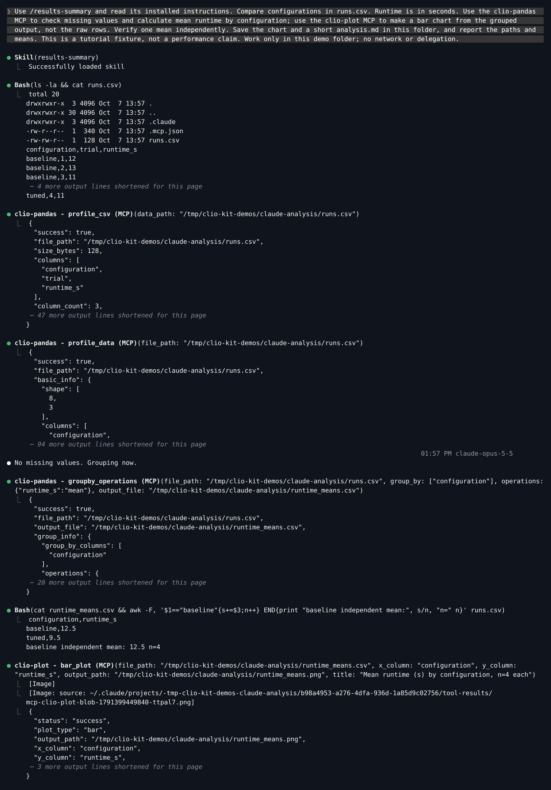
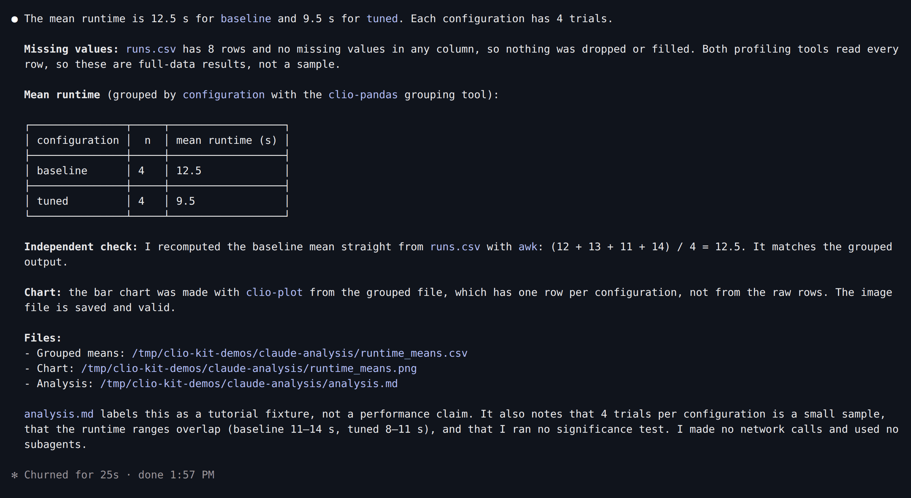
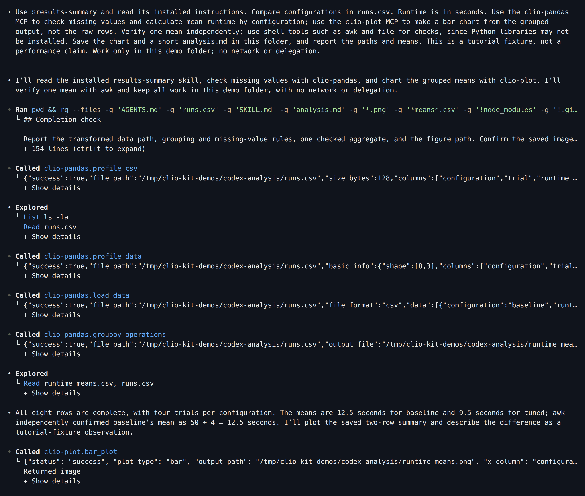
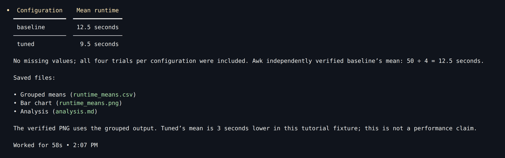
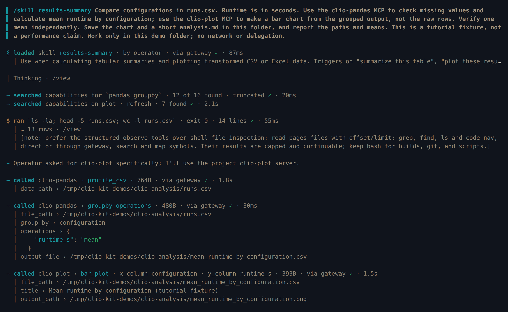
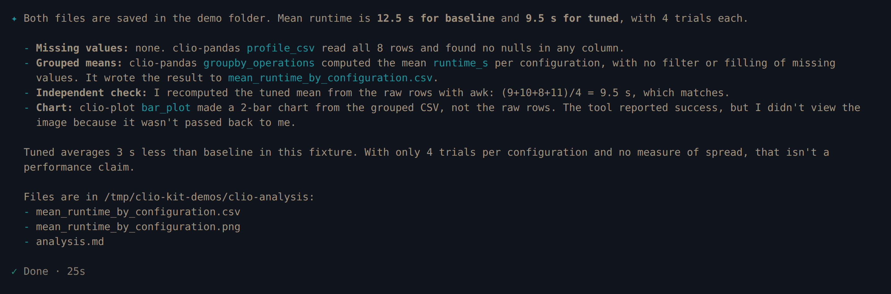
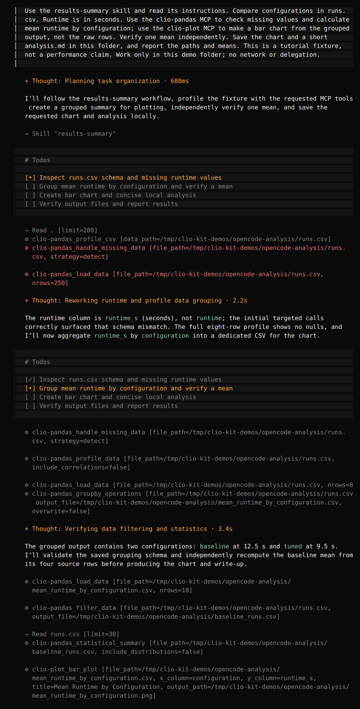
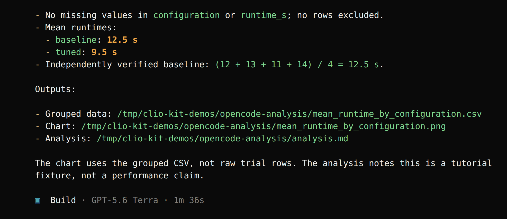
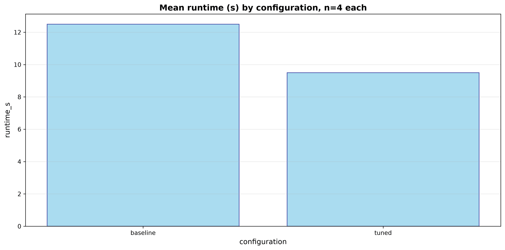

import Tabs from '@theme/Tabs';
import TabItem from '@theme/TabItem';
import TutorialHeader from '@site/src/components/TutorialHeader';

<TutorialHeader />

Give your agent a CSV of experiment runs and ask it to compare configurations.
You connect the **Pandas** and **Plot** MCP servers, add the **results-summary**
skill, and produce a grouped CSV, a bar chart and a short analysis. The
screenshots are real sessions in Claude Code, Codex, Clio Coder and OpenCode,
recorded with the versions listed in [Explore an HDF5 file](./codex-dataset.md).
The eight rows are a tutorial fixture, not evidence of a real system's
performance.

## 1. Add the experiment results

Start with the [CLIO Kit launcher](../clients.md#1-install-the-launcher)
installed. In a new project, [download runs.csv](./runs.csv) or save this as
`runs.csv`:

```csv
configuration,trial,runtime_s
baseline,1,12
baseline,2,13
baseline,3,11
baseline,4,14
tuned,1,9
tuned,2,10
tuned,3,8
tuned,4,11
```

Each row is one trial, and `runtime_s` is elapsed time in seconds.

## 2. Connect the tools, install the skill and ask

The skill explains how to pass transformed data between the two servers. It does
not configure either MCP by itself.

<Tabs groupId="client" queryString>
<TabItem value="claude" label="Claude Code" default>

```bash
claude mcp add --scope project clio-pandas -- clio-kit mcp-server pandas
claude mcp add --scope project clio-plot -- clio-kit mcp-server plot
clio-kit skill install results-summary --target .claude/skills
claude
```

The two MCP entries go in `.mcp.json`; the skill goes in
`.claude/skills/results-summary/`.

[](../../website/static/img/tutorials/claude-install.png)

Enable the two project MCP servers, check `/mcp`, then ask:

> Use /results-summary and read its installed instructions. Compare
> configurations in runs.csv. Runtime is in seconds. Use the clio-pandas MCP to
> check missing values and calculate mean runtime by configuration; use the
> clio-plot MCP to make a bar chart from the grouped output, not the raw rows.
> Verify one mean independently. Save the chart and a short analysis.md in this
> folder, and report the paths and means. This is a tutorial fixture, not a
> performance claim. Work only in this demo folder; no network or delegation.

`Ctrl+O` shows each tool call. Pandas profiled the table and wrote the grouped
means to `runtime_means.csv`; Claude passed **that file** to Plot's `bar_plot`:

[](../../website/static/img/tutorials/analysis-claude-tools.png)

[](../../website/static/img/tutorials/analysis-claude-result.png)

</TabItem>
<TabItem value="codex" label="Codex">

Save this as `.codex/config.toml` in the project:

```toml
[mcp_servers.clio-pandas]
command = "clio-kit"
args = ["mcp-server", "pandas"]
startup_timeout_sec = 120

[mcp_servers.clio-plot]
command = "clio-kit"
args = ["mcp-server", "plot"]
startup_timeout_sec = 120
```

```bash
clio-kit skill install results-summary --target .agents/skills
codex
```

Trust the folder, check `/mcp`, then ask:

> Use $results-summary and read its installed instructions. Compare
> configurations in runs.csv. Runtime is in seconds. Use the clio-pandas MCP to
> check missing values and calculate mean runtime by configuration; use the
> clio-plot MCP to make a bar chart from the grouped output, not the raw rows.
> Verify one mean independently; use shell tools such as awk and file for checks,
> since Python libraries may not be installed. Save the chart and a short
> analysis.md in this folder, and report the paths and means. This is a tutorial
> fixture, not a performance claim. Work only in this demo folder; no network or
> delegation.

The shell-tools sentence matters: without it, Codex tried to check the chart
with a Python imaging library that was not installed.

[](../../website/static/img/tutorials/analysis-codex-tools.png)

[](../../website/static/img/tutorials/analysis-codex-result.png)

</TabItem>
<TabItem value="clio" label="Clio Coder">

Save this as `.clio-coder/mcp.yaml`:

```yaml
version: 1
servers:
  - id: clio-pandas
    command: clio-kit
    args: [mcp-server, pandas]
    timeoutMs: 120000
  - id: clio-plot
    command: clio-kit
    args: [mcp-server, plot]
    timeoutMs: 120000
```

```bash
clio-coder mcp trust clio-pandas
clio-coder mcp trust clio-plot
clio-kit skill install results-summary --target .clio-coder/skills
clio-coder
```

Ask:

> /skill results-summary Compare configurations in runs.csv. Runtime is in
> seconds. Use the clio-pandas MCP to check missing values and calculate mean
> runtime by configuration; use the clio-plot MCP to make a bar chart from the
> grouped output, not the raw rows. Verify one mean independently. Save the chart
> and a short analysis.md in this folder, and report the paths and means. This is
> a tutorial fixture, not a performance claim. Work only in this demo folder; no
> network or delegation.

[](../../website/static/img/tutorials/analysis-clio-tools.png)

[](../../website/static/img/tutorials/analysis-clio-result.png)

</TabItem>
<TabItem value="opencode" label="OpenCode">

Save this as `opencode.json` in the project:

```json
{
  "$schema": "https://opencode.ai/config.json",
  "mcp": {
    "clio-pandas": {
      "type": "local",
      "command": ["clio-kit", "mcp-server", "pandas"],
      "enabled": true,
      "timeout": 120000
    },
    "clio-plot": {
      "type": "local",
      "command": ["clio-kit", "mcp-server", "plot"],
      "enabled": true,
      "timeout": 120000
    }
  }
}
```

```bash
clio-kit skill install results-summary --target .agents/skills
opencode
```

Ask:

> Use the results-summary skill and read its instructions. Compare
> configurations in runs.csv. Runtime is in seconds. Use the clio-pandas MCP to
> check missing values and calculate mean runtime by configuration; use the
> clio-plot MCP to make a bar chart from the grouped output, not the raw rows.
> Verify one mean independently. Save the chart and a short analysis.md in this
> folder, and report the paths and means. This is a tutorial fixture, not a
> performance claim. Work only in this demo folder; no network or delegation.

[](../../website/static/img/tutorials/analysis-opencode-tools.png)

[](../../website/static/img/tutorials/analysis-opencode-result.png)

</TabItem>
</Tabs>

## 3. Watch the handoff between tools

In every session Pandas grouped the rows and saved the means to a new CSV, and the
agent passed **that file** to `bar_plot`. This is why the skill matters: the
plotting server reads a file, not an in-memory Pandas result. Plotting the
original CSV would skip the aggregation you asked for. File names differ between
clients (`runtime_means.csv` or `mean_runtime_by_configuration.csv`); open the
path your agent reports.

## 4. Open the outputs and verify the numbers

```bash
cat analysis.md
```

The grouped file should contain:

```csv
configuration,runtime_s
baseline,12.5
tuned,9.5
```

Check the means yourself: `(12 + 13 + 11 + 14) / 4 = 12.5` seconds;
`(9 + 10 + 8 + 11) / 4 = 9.5` seconds. After the four recorded sessions we
recomputed both means from the source CSV, compared them with each saved grouped
file, and confirmed `runs.csv` was unchanged.

Here is the chart the Plot MCP produced in the Claude Code session:

[](../../website/static/img/tutorials/analysis-claude-chart.png)

Check the units, categories and heights, not only whether the image exists.

If a tool is missing, run `clio-kit doctor --server pandas --server plot --connect`
and check your client's MCP list. If the skill is missing, check its installed
directory and start a fresh session. Model wording and file names can differ;
tool inputs and numeric results are the checks that matter.

Next: [explore an HDF5 file](./codex-dataset.md), or
[build your own plugin](./contribute-plugin.md).
