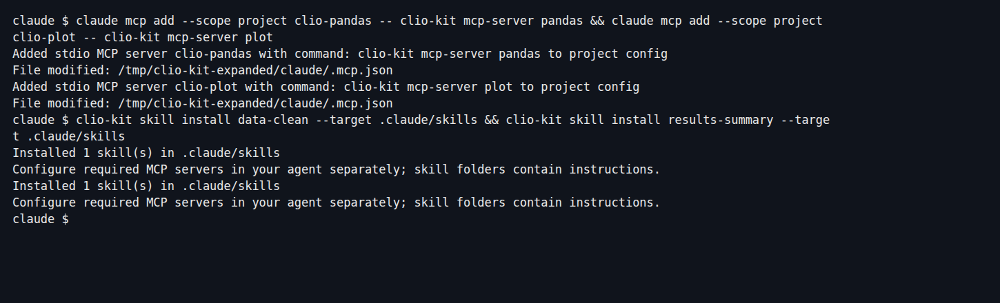
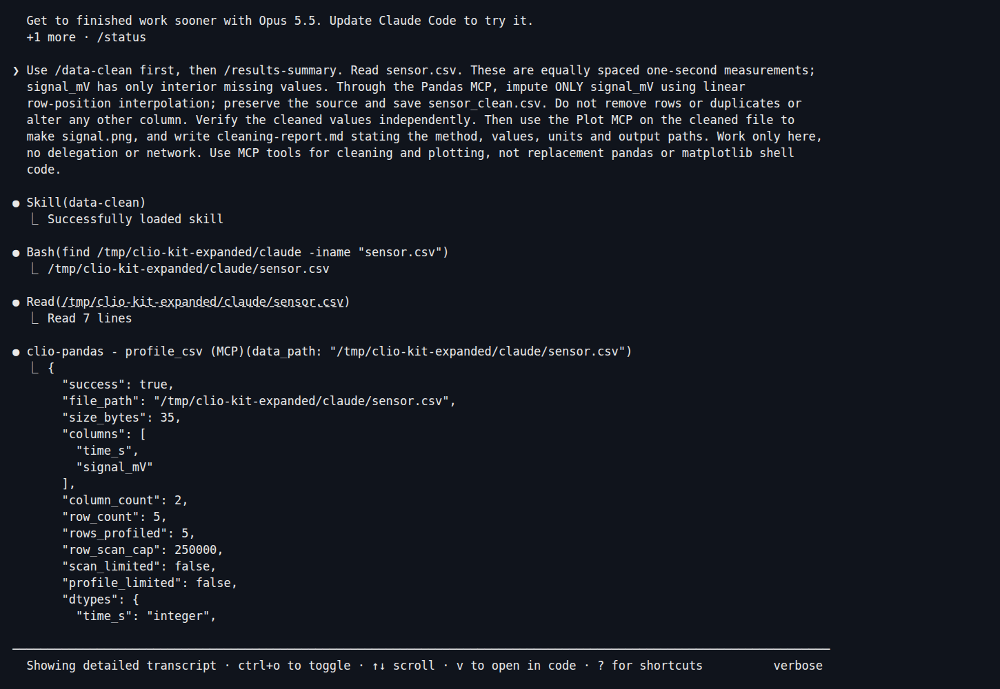
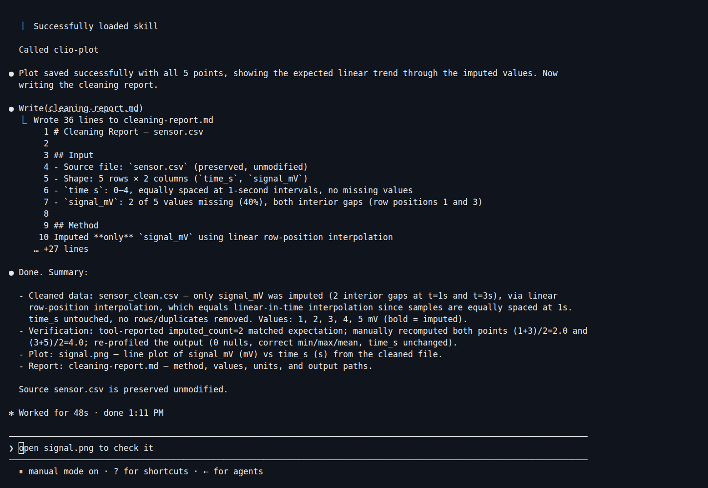
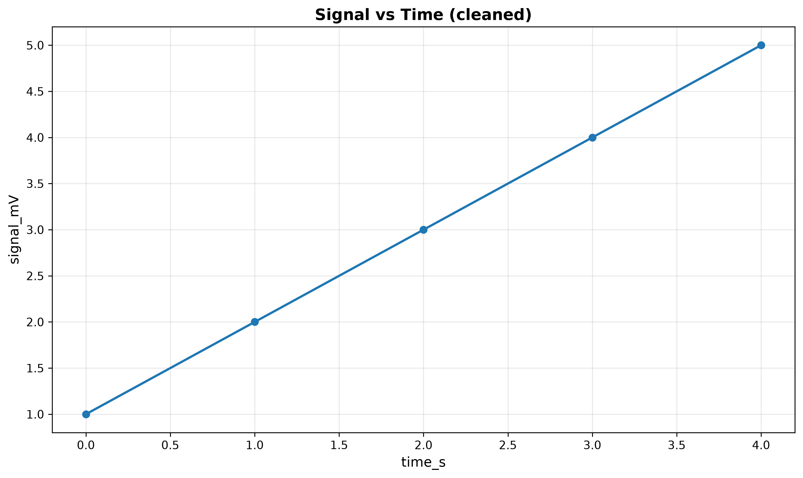

Use two skills in sequence: **data-clean** for a specific repair, then
**results-summary** for the handoff to Plot. Claude Code uses the real **Pandas**
and **Plot** MCPs. These captures are from Claude Code 2.1.269 with Sonnet 5.

## 1. Install two MCPs and two skills

With the [launcher installed](../clients.md#1-install-the-launcher), make a new
project and run:

```bash
mkdir sensor-demo
cd sensor-demo
claude mcp add --scope project clio-pandas -- clio-kit mcp-server pandas
claude mcp add --scope project clio-plot -- clio-kit mcp-server plot
clio-kit skill install data-clean --target .claude/skills
clio-kit skill install results-summary --target .claude/skills
```

[](../../clio-kit-website/static/img/tutorials/clean-install.png)

## 2. Supply a bounded repair

[Download sensor.csv](./sensor.csv), or save this as `sensor.csv`:

```csv
time_s,signal_mV
0,1
1,
2,3
3,
4,5
```

The samples are one second apart. For this demonstration, we explicitly choose
linear interpolation for the two interior gaps. That choice is part of the task;
missing data alone does not justify a particular imputation method.

Start `claude`, approve the intended project MCPs, and ask:

> Use /data-clean first, then /results-summary. Read sensor.csv. These are equally
> spaced one-second measurements; signal_mV has only interior missing values.
> Through the Pandas MCP, impute ONLY signal_mV using linear row-position
> interpolation; preserve the source and save sensor_clean.csv. Do not remove
> rows or duplicates or alter any other column. Verify the cleaned values
> independently. Then use the Plot MCP on the cleaned file to make signal.png,
> and write cleaning-report.md stating the method, values, units and output paths.
> Work only here, no delegation or network. Use MCP tools for cleaning and
> plotting, not replacement pandas or matplotlib shell code.

Review requests to create or copy the output files. The captured run also asked
to remove its intermediate `sensor_imputed.csv`; the source and final cleaned
file were retained.

[](../../clio-kit-website/static/img/tutorials/clean-skill.png)

## 3. Inspect the transformation

The Pandas operation uses `strategy="impute"`, `method="interpolate"` and
`columns=["signal_mV"]`. It reported two actual fills. The second skill tells
Claude to plot the **cleaned file**, not the original input.

[](../../clio-kit-website/static/img/tutorials/clean-result.png)

```bash
cat sensor.csv
cat sensor_clean.csv
cat cleaning-report.md
```

Check that the source still has its two empty cells. The cleaned signals should
be `1, 2, 3, 4, 5`, with timestamps `0, 1, 2, 3, 4` and exactly five rows.
The two interpolations are `(1+3)/2 = 2` and `(3+5)/2 = 4`. We independently
checked these values and source preservation after the recorded session.

## 4. Open the figure

[](../../clio-kit-website/static/img/tutorials/signal-chart.png)

This is the generated `signal.png`. A smooth line does not prove a repair is
scientifically justified: check the values, chosen method and measurement process.
Row-position interpolation is not a time-aware method for irregular timestamps.

Next: [compare grouped experiment results](./claude-analysis.md), or
[choose a storage layout](./choose-storage.md).
