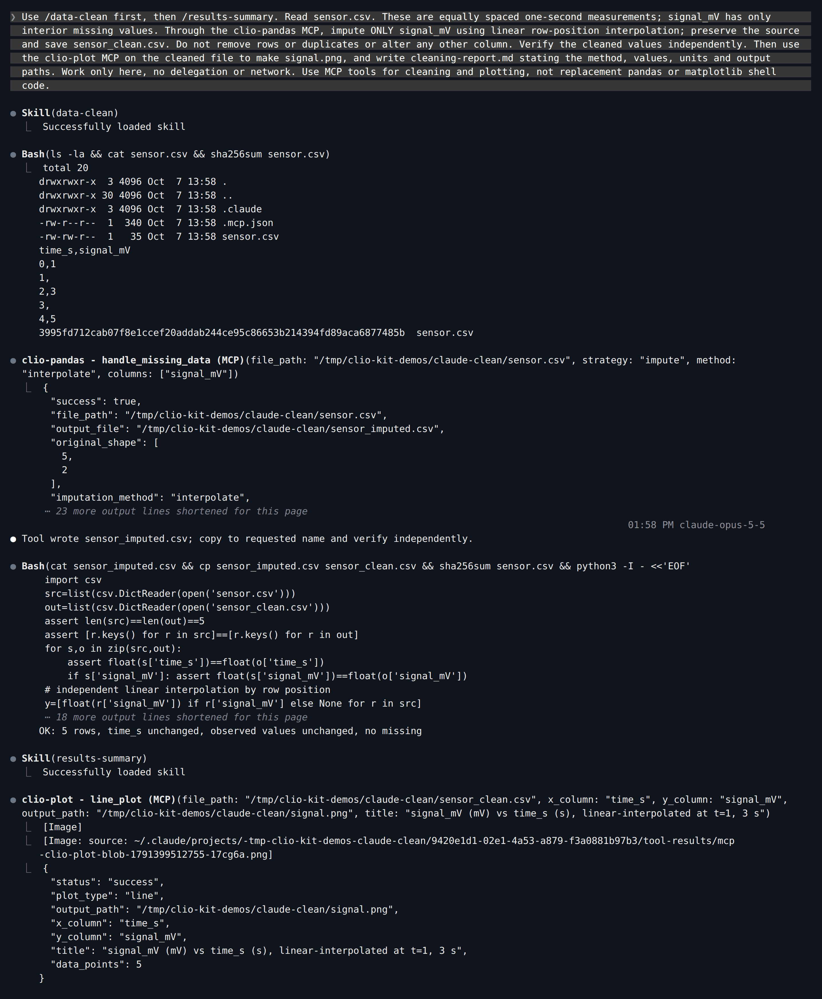
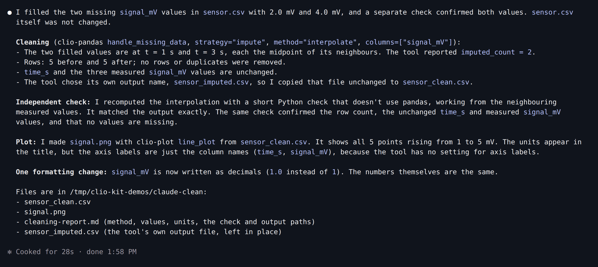
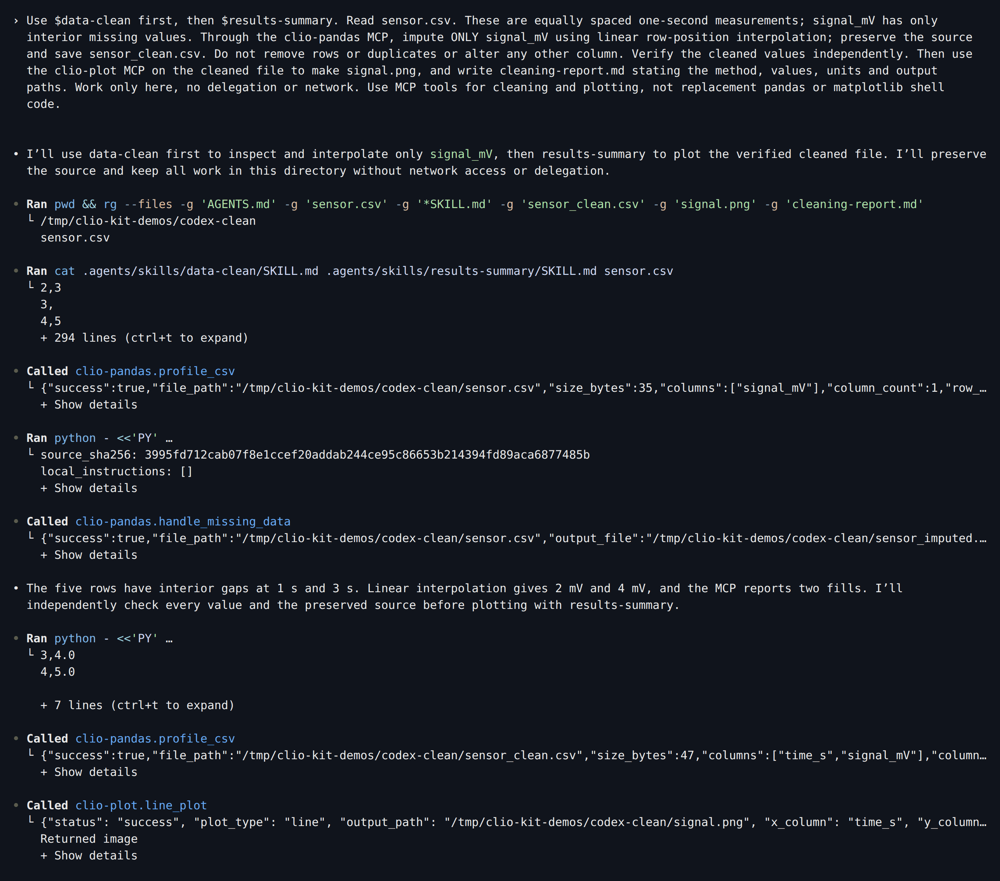
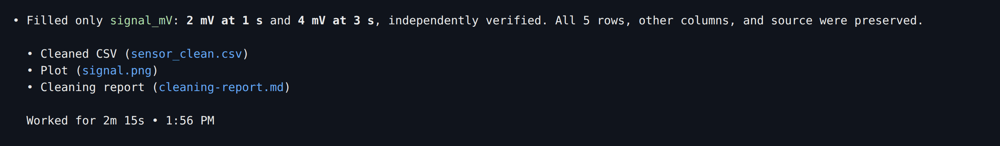
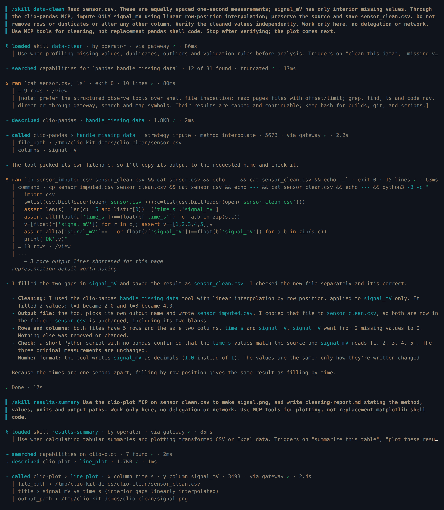
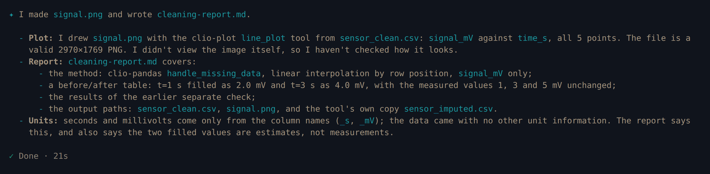
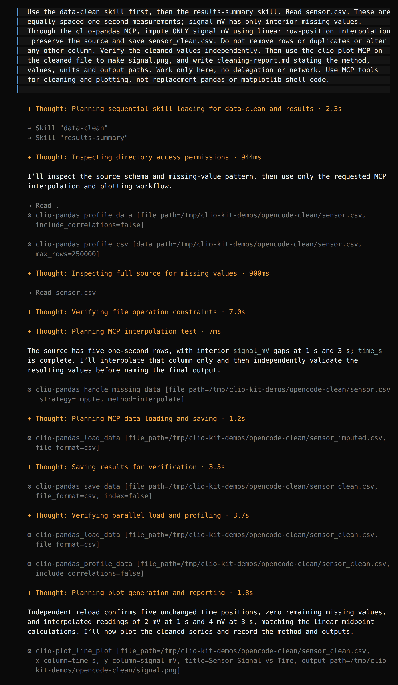
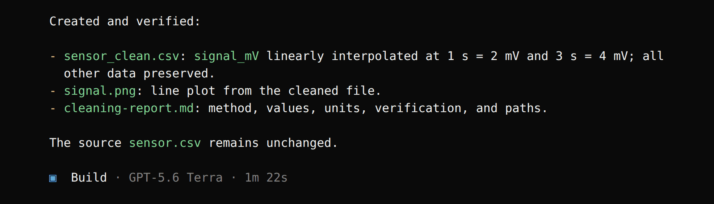
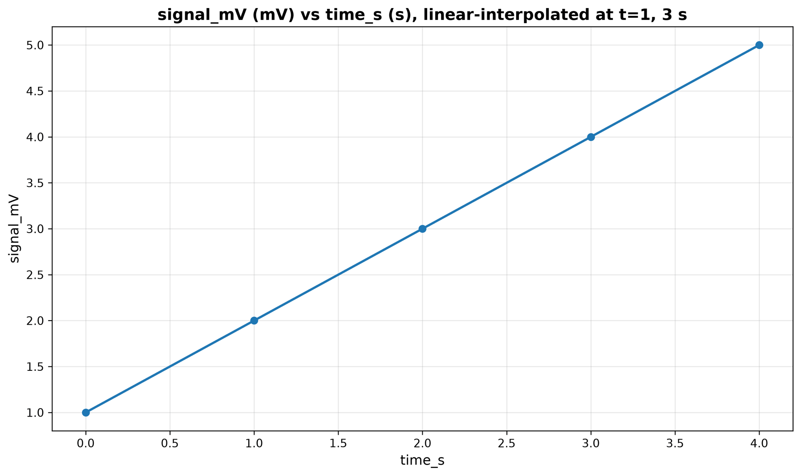

import Tabs from '@theme/Tabs';
import TabItem from '@theme/TabItem';
import TutorialHeader from '@site/src/components/TutorialHeader';

<TutorialHeader />

Use two skills in sequence: **data-clean** for a specific repair, then
**results-summary** for the handoff to Plot. The agent works through the real
**Pandas** and **Plot** MCPs. The screenshots are real sessions in Claude Code,
Codex, Clio Coder and OpenCode, recorded with the versions listed in
[Explore an HDF5 file](./codex-dataset.md).

## 1. Supply a bounded repair

With the [launcher installed](../clients.md#1-install-the-launcher), make a new
project. [Download sensor.csv](./sensor.csv), or save this as `sensor.csv`:

```csv
time_s,signal_mV
0,1
1,
2,3
3,
4,5
```

The samples are one second apart. For this demonstration we explicitly choose
linear interpolation for the two interior gaps. That choice is part of the task;
missing data alone does not justify a particular imputation method.

## 2. Install two MCPs and two skills, then ask

Each client keeps project MCP servers in its own file. The two skills are the
same portable folders in every client.

<Tabs groupId="client" queryString>
<TabItem value="claude" label="Claude Code" default>

```bash
claude mcp add --scope project clio-pandas -- clio-kit mcp-server pandas
claude mcp add --scope project clio-plot -- clio-kit mcp-server plot
clio-kit skill install data-clean --target .claude/skills
clio-kit skill install results-summary --target .claude/skills
claude
```

[](../../website/static/img/tutorials/clean-install.png)

Enable the two project MCP servers, then paste:

> Use /data-clean first, then /results-summary. Read sensor.csv. These are
> equally spaced one-second measurements; signal_mV has only interior missing
> values. Through the clio-pandas MCP, impute ONLY signal_mV using linear
> row-position interpolation; preserve the source and save sensor_clean.csv. Do
> not remove rows or duplicates or alter any other column. Verify the cleaned
> values independently. Then use the clio-plot MCP on the cleaned file to make
> signal.png, and write cleaning-report.md stating the method, values, units and
> output paths. Work only here, no delegation or network. Use MCP tools for
> cleaning and plotting, not replacement pandas or matplotlib shell code.

[](../../website/static/img/tutorials/clean-claude-tools.png)

[](../../website/static/img/tutorials/clean-claude-result.png)

</TabItem>
<TabItem value="codex" label="Codex">

Save this as `.codex/config.toml` in the project, which Codex reads once you
trust the folder:

```toml
[mcp_servers.clio-pandas]
command = "clio-kit"
args = ["mcp-server", "pandas"]
startup_timeout_sec = 120

[mcp_servers.clio-plot]
command = "clio-kit"
args = ["mcp-server", "plot"]
startup_timeout_sec = 120
```

```bash
clio-kit skill install data-clean --target .agents/skills
clio-kit skill install results-summary --target .agents/skills
codex
```

Paste:

> Use $data-clean first, then $results-summary. Read sensor.csv. These are
> equally spaced one-second measurements; signal_mV has only interior missing
> values. Through the clio-pandas MCP, impute ONLY signal_mV using linear
> row-position interpolation; preserve the source and save sensor_clean.csv. Do
> not remove rows or duplicates or alter any other column. Verify the cleaned
> values independently. Then use the clio-plot MCP on the cleaned file to make
> signal.png, and write cleaning-report.md stating the method, values, units and
> output paths. Work only here, no delegation or network. Use MCP tools for
> cleaning and plotting, not replacement pandas or matplotlib shell code.

[](../../website/static/img/tutorials/clean-codex-tools.png)

[](../../website/static/img/tutorials/clean-codex-result.png)

</TabItem>
<TabItem value="clio" label="Clio Coder">

Save this as `.clio-coder/mcp.yaml`:

```yaml
version: 1
servers:
  - id: clio-pandas
    command: clio-kit
    args: [mcp-server, pandas]
    timeoutMs: 120000
  - id: clio-plot
    command: clio-kit
    args: [mcp-server, plot]
    timeoutMs: 120000
```

```bash
clio-coder mcp trust clio-pandas
clio-coder mcp trust clio-plot
clio-kit skill install data-clean --target .clio-coder/skills
clio-kit skill install results-summary --target .clio-coder/skills
clio-coder
```

`/skill` activates exactly one skill for a turn, so use two turns. First the
repair:

> /skill data-clean Read sensor.csv. These are equally spaced one-second
> measurements; signal_mV has only interior missing values. Through the
> clio-pandas MCP, impute ONLY signal_mV using linear row-position interpolation;
> preserve the source and save sensor_clean.csv. Do not remove rows or duplicates
> or alter any other column. Verify the cleaned values independently. Work only
> here, no delegation or network. Use MCP tools for cleaning, not replacement
> pandas shell code. Stop after verifying; the plot comes next.

Then the handoff to Plot:

> /skill results-summary Use the clio-plot MCP on sensor_clean.csv to make
> signal.png, and write cleaning-report.md stating the method, values, units and
> output paths. Work only here, no delegation or network. Use MCP tools for
> plotting, not replacement matplotlib shell code.

[](../../website/static/img/tutorials/clean-clio-tools.png)

[](../../website/static/img/tutorials/clean-clio-result.png)

</TabItem>
<TabItem value="opencode" label="OpenCode">

Save this as `opencode.json` in the project:

```json
{
  "$schema": "https://opencode.ai/config.json",
  "mcp": {
    "clio-pandas": {
      "type": "local",
      "command": ["clio-kit", "mcp-server", "pandas"],
      "enabled": true,
      "timeout": 120000
    },
    "clio-plot": {
      "type": "local",
      "command": ["clio-kit", "mcp-server", "plot"],
      "enabled": true,
      "timeout": 120000
    }
  }
}
```

```bash
clio-kit skill install data-clean --target .agents/skills
clio-kit skill install results-summary --target .agents/skills
opencode
```

Paste:

> Use the data-clean skill first, then the results-summary skill. Read
> sensor.csv. These are equally spaced one-second measurements; signal_mV has
> only interior missing values. Through the clio-pandas MCP, impute ONLY
> signal_mV using linear row-position interpolation; preserve the source and save
> sensor_clean.csv. Do not remove rows or duplicates or alter any other column.
> Verify the cleaned values independently. Then use the clio-plot MCP on the
> cleaned file to make signal.png, and write cleaning-report.md stating the
> method, values, units and output paths. Work only here, no delegation or
> network. Use MCP tools for cleaning and plotting, not replacement pandas or
> matplotlib shell code.

[](../../website/static/img/tutorials/clean-opencode-tools.png)

[](../../website/static/img/tutorials/clean-opencode-result.png)

</TabItem>
</Tabs>

## 3. Inspect the transformation

In all four sessions the Pandas `handle_missing_data` tool filled the gaps and
wrote its output to `sensor_imputed.csv`; the agent then saved the requested
`sensor_clean.csv`. The second skill tells the agent to plot the **cleaned file**,
not the original input, and every client passed `sensor_clean.csv` to
`line_plot`.

```bash
cat sensor.csv
cat sensor_clean.csv
cat cleaning-report.md
```

Check that the source still has its two empty cells. The cleaned signals should
be `1, 2, 3, 4, 5`, with timestamps `0, 1, 2, 3, 4` and exactly five rows. The
two interpolations are `(1+3)/2 = 2` and `(3+5)/2 = 4`. We checked these values
and the unchanged source in all four recorded projects.

## 4. Open the figure

[](../../website/static/img/tutorials/clean-claude-chart.png)

This is the `signal.png` from the Claude Code session; the other clients plotted
the same five cleaned points. A smooth line does not prove a repair
is scientifically justified: check the values, the chosen method and the
measurement process. Row-position interpolation is not a time-aware method for
irregular timestamps.

Next: [compare grouped experiment results](./claude-analysis.md), or
[choose a storage layout](./choose-storage.md).
