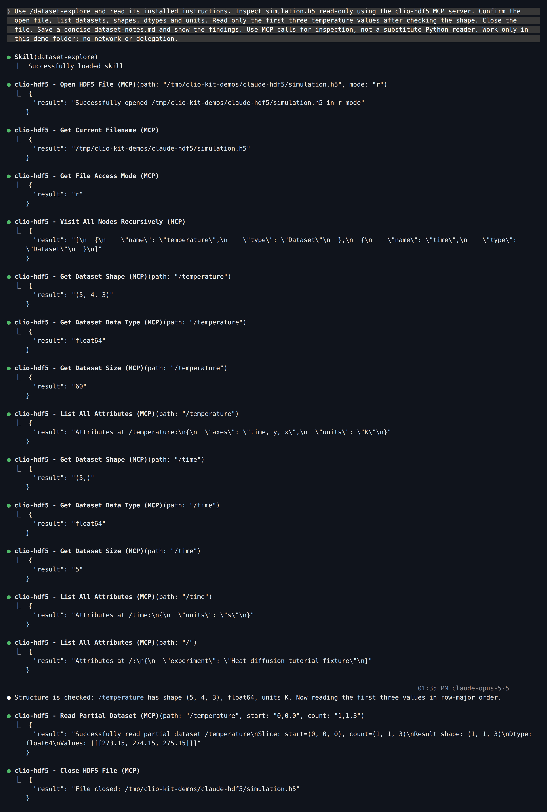
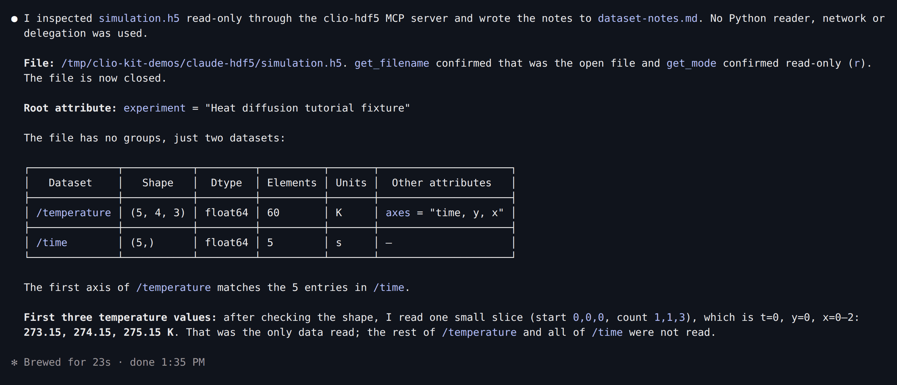
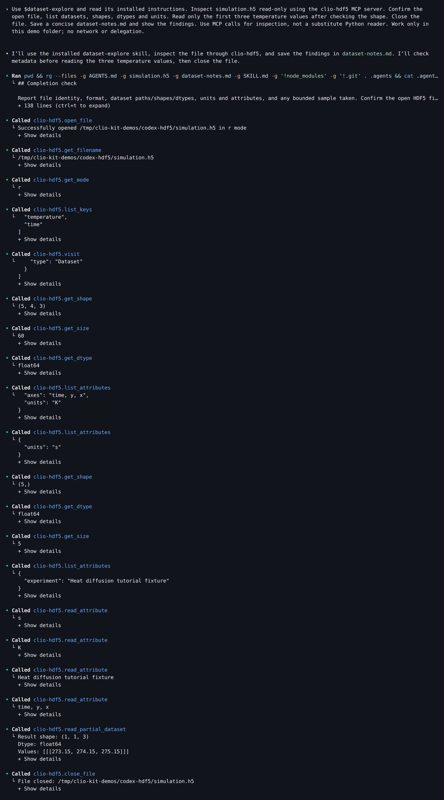
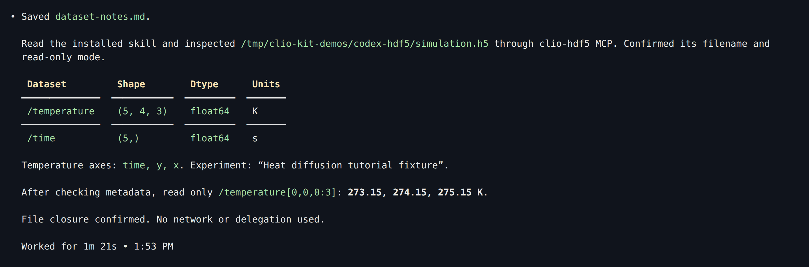
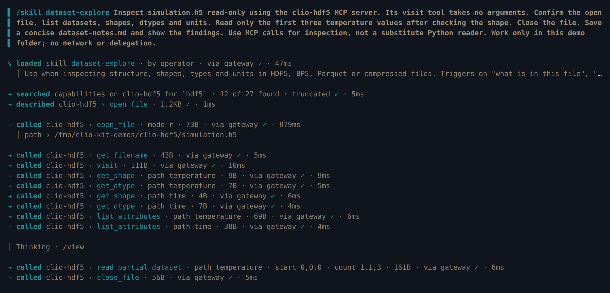
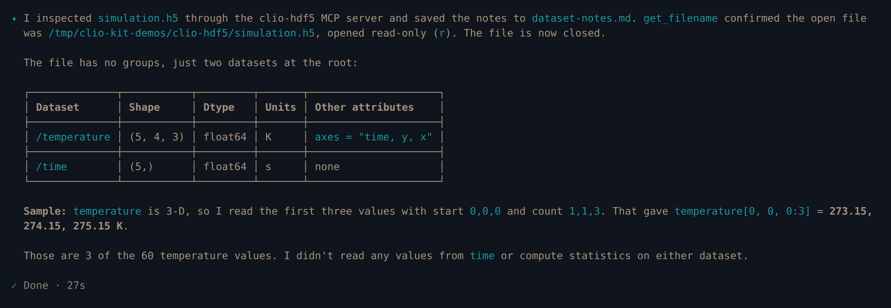
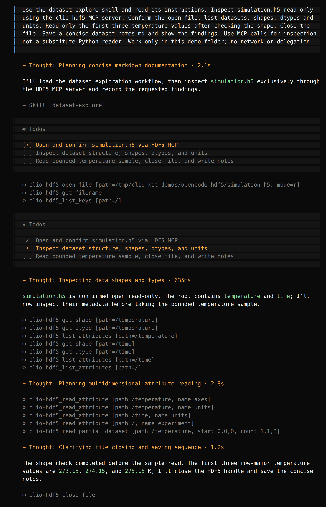
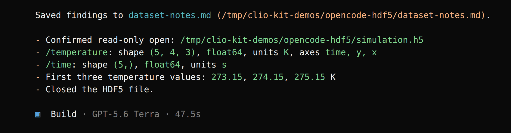

import Tabs from '@theme/Tabs';
import TabItem from '@theme/TabItem';
import TutorialHeader from '@site/src/components/TutorialHeader';

<TutorialHeader />

Install a workflow, open your agent, and ask what is inside a scientific data
file. This walkthrough uses the **clio-scientific-io** components, the
**dataset-explore** skill and the **HDF5 MCP**. You finish with a short report you
can check against the input.

The screenshots come from real sessions recorded on 7 October 2026 in disposable
folders: Claude Code 2.1.293 (Opus 5.5), Codex 0.160.1 (GPT-6-Astra), Clio Coder
0.6.1 (Claude Opus 5.5) and OpenCode 1.18.35 (GPT-5.6 Terra). Each client ran in
its permission-bypass mode inside those folders; keep approvals on in your own
projects. Pick your client once and every tutorial follows it.

## 1. Create a file you can check

First [install the CLIO Kit launcher](../clients.md#1-install-the-launcher) from
your checkout. Make a new folder, [download create_dataset.py](./create_dataset.py)
into it, and run:

```bash
mkdir hdf5-demo
cd hdf5-demo
uv run --no-project --with h5py python create_dataset.py
```

The script creates `simulation.h5` and refuses to replace an existing file. It
holds a five-element time axis in seconds and a `(5, 4, 3)` temperature array in
kelvin. The first three temperatures are 273.15, 274.15 and 275.15, so you can
check the agent's answer.

## 2. Install, ask and follow the tool calls

Replace `/path/to/clio-kit` with your checkout.

<Tabs groupId="client" queryString>
<TabItem value="claude" label="Claude Code" default>

```bash
clio-kit plugin install clio-scientific-io \
  --root /path/to/clio-kit --client claude-code --project "$PWD"
claude
```

The installer adds three skills to `.claude/skills` and four MCP servers to
`.mcp.json`: HDF5, ADIOS, Parquet and Compression. Trust the folder, enable the
project MCP servers when asked, then paste:

> Use /dataset-explore and read its installed instructions. Inspect simulation.h5
> read-only using the clio-hdf5 MCP server. Confirm the open file, list datasets,
> shapes, dtypes and units. Read only the first three temperature values after
> checking the shape. Close the file. Save a concise dataset-notes.md and show the
> findings. Use MCP calls for inspection, not a substitute Python reader. Work
> only in this demo folder; no network or delegation.

Claude loads the skill, then calls the HDF5 tools one by one. Press `Ctrl+O` for
the detailed transcript shown here:

[](../../website/static/img/tutorials/hdf5-claude-tools.png)

[](../../website/static/img/tutorials/hdf5-claude-result.png)

</TabItem>
<TabItem value="codex" label="Codex">

```bash
clio-kit plugin install clio-scientific-io \
  --root /path/to/clio-kit --client codex --project "$PWD"
codex
```

The installer adds three skills to `.agents/skills` and four MCP servers to
`.codex/config.toml`. Trust the folder, check `/mcp`, then paste:

> Use $dataset-explore and read its installed instructions. Inspect simulation.h5
> read-only using the clio-hdf5 MCP server. Confirm the open file, list datasets,
> shapes, dtypes and units. Read only the first three temperature values after
> checking the shape. Close the file. Save a concise dataset-notes.md and show the
> findings. Use MCP calls for inspection, not a substitute Python reader. Work
> only in this demo folder; no network or delegation.

Codex lists each MCP call as `Called clio-hdf5.<tool>`:

[](../../website/static/img/tutorials/hdf5-codex-tools.png)

[](../../website/static/img/tutorials/hdf5-codex-result.png)

</TabItem>
<TabItem value="clio" label="Clio Coder">

Clio Coder reads project MCP servers from `.clio-coder/mcp.yaml` and loose
project skills from `.clio-coder/skills`. Save this file as
`.clio-coder/mcp.yaml`:

```yaml
version: 1
servers:
  - id: clio-hdf5
    command: clio-kit
    args: [mcp-server, hdf5]
    timeoutMs: 120000
```

Then trust the declaration, add the skills and start a session:

```bash
clio-coder mcp trust clio-hdf5
clio-kit skill install dataset-explore --target .clio-coder/skills
clio-kit skill install large-data-read --target .clio-coder/skills
clio-coder
```

A project server does not launch until you trust it. Paste:

> /skill dataset-explore Inspect simulation.h5 read-only using the clio-hdf5 MCP
> server. Its visit tool takes no arguments. Confirm the open file, list datasets,
> shapes, dtypes and units. Read only the first three temperature values after
> checking the shape. Close the file. Save a concise dataset-notes.md and show the
> findings. Use MCP calls for inspection, not a substitute Python reader. Work
> only in this demo folder; no network or delegation.

Clio reaches MCP tools through its gateway, so it describes a tool before calling
it. The note about `visit` saves one rejected call: unlike the other HDF5 tools,
`visit` takes no `path`.

[](../../website/static/img/tutorials/hdf5-clio-tools.png)

[](../../website/static/img/tutorials/hdf5-clio-result.png)

</TabItem>
<TabItem value="opencode" label="OpenCode">

```bash
clio-kit plugin install clio-scientific-io \
  --root /path/to/clio-kit --client opencode --project "$PWD"
opencode
```

The installer adds three skills to `.agents/skills` and four local MCP servers to
`opencode.json`. Check that they show as connected in the sidebar, then paste:

> Use the dataset-explore skill and read its instructions. Inspect simulation.h5
> read-only using the clio-hdf5 MCP server. Confirm the open file, list datasets,
> shapes, dtypes and units. Read only the first three temperature values after
> checking the shape. Close the file. Save a concise dataset-notes.md and show the
> findings. Use MCP calls for inspection, not a substitute Python reader. Work
> only in this demo folder; no network or delegation.

OpenCode shows each MCP call as `⚙ clio-hdf5_<tool>` with its arguments:

[](../../website/static/img/tutorials/hdf5-opencode-tools.png)

[](../../website/static/img/tutorials/hdf5-opencode-result.png)

</TabItem>
</Tabs>

The skill's useful part is the order: check structure and units **before**
reading values. Every client asked for a `start="0,0,0"`, `count="1,1,3"` slice
instead of pulling the whole array into the conversation.

*Select a screenshot to open it at full size. These are captures of the actual
terminal sessions, not recreated conversations.*

## 3. Check the result

```bash
cat dataset-notes.md
```

Your report should identify:

| Dataset | Shape | Type | Units |
| --- | --- | --- | --- |
| `/time` | `(5,)` | `float64` | seconds (`s`) |
| `/temperature` | `(5, 4, 3)` | `float64` | kelvin (`K`) |

Check that the sample is `273.15, 274.15, 275.15` and that the file was closed.
After the four recorded sessions we checked each saved report against these
known values. A correct-looking report alone is not that check.

For your own file, keep the same request but use its path. If it is large,
inspect shape and dtype first and use the `large-data-read` skill for bounded
reductions.

If the MCP is unavailable, run `clio-kit doctor --server hdf5 --connect`, check
the client's PATH and reload the project. An installed skill does not replace a
missing MCP connection.

Next: [archive and summarize a dataset](./archive-and-summarize.md),
[summarize and plot a CSV](./claude-analysis.md), or
[contribute your own plugin](./contribute-plugin.md).
