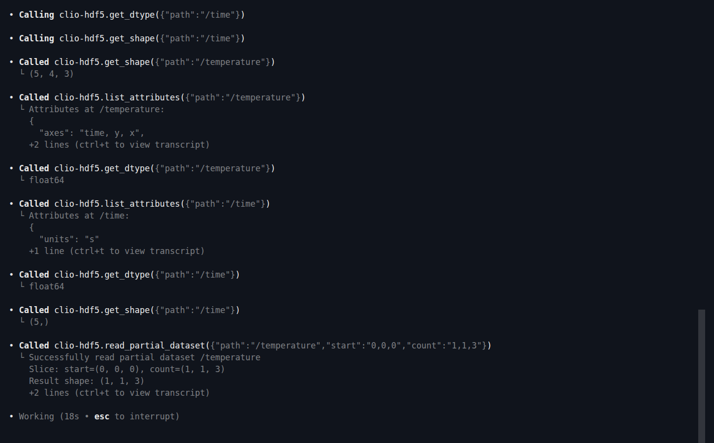
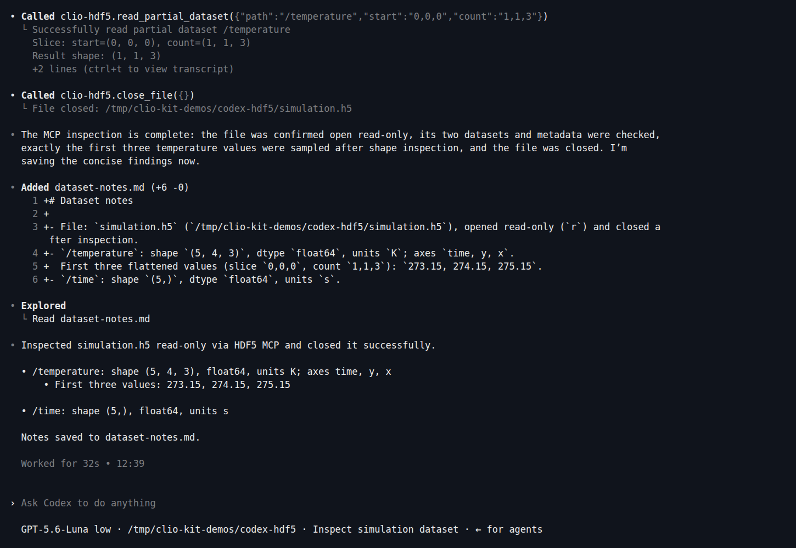

Install a workflow plugin, open Codex, and ask what is inside a scientific data
file. This walkthrough uses **clio-scientific-io**, its **dataset-explore** skill
and the **HDF5 MCP**. You will finish with a small report you can check against
the input.

The screenshots are from an actual Codex CLI session (0.159.2, GPT-5.6-Luna).
The input is a small tutorial fixture; use it before trying your own data.

## 1. Install the workflow

First [install the CLIO Kit launcher](../clients.md#1-install-the-launcher) from
your checkout, and sign in to Codex. Make a new working folder:

```bash
mkdir codex-hdf5
cd codex-hdf5
clio-kit plugin install clio-scientific-io \
  --root /path/to/clio-kit --client codex --project "$PWD"
```

Replace `/path/to/clio-kit` with your checkout. In the screenshots, `../kit`
points to that checkout. The installer adds three skills to `.agents/skills`
and four MCP entries to `.codex/config.toml`: HDF5, ADIOS, Parquet and Compression.
This is the plugin's portable component installation; it does not install a
Claude-native plugin into Codex. This tutorial exercises HDF5.

[](../../clio-kit-website/static/img/tutorials/codex-install.png)

## 2. Create a file you can check

[Download create_dataset.py](./create_dataset.py) into your new folder, or copy
it from `docs/tutorials/` in the checkout. Then run:

```bash
uv run --no-project --with h5py python create_dataset.py
```

The script creates `simulation.h5` and refuses to replace an existing file.
It contains a five-element time axis in seconds and a `(5, 4, 3)` temperature
array in kelvin. The first three temperatures are 273.15, 274.15 and 275.15.
These known values let you check the agent's answer.

## 3. Open Codex and ask it to inspect the file

```bash
codex
```

Trust the intended project and check `/mcp` for the configured servers. First
starts can download server dependencies. Keep your normal approval settings;
allow the intended MCP calls and creation of the report in this demo folder.

Paste this request:

> Use $dataset-explore and read its installed instructions. Inspect simulation.h5
> read-only using the HDF5 MCP. Confirm the open file, list datasets, shapes,
> dtypes and units. Read only the first three temperature values after checking
> the shape. Close the file. Save a concise dataset-notes.md and show the
> findings. Use MCP calls for inspection, not a substitute Python reader.
> Work only in this demo folder; no network or delegation.

## 4. Follow the tool calls

Codex read the installed skill, opened the file, and called the HDF5 tools for
shapes, types and attributes before requesting a small slice. The skill's useful
part here is the order: inspect structure and units **before** reading values.

[](../../clio-kit-website/static/img/tutorials/codex-working.png)

The sample request uses `start="0,0,0"` and `count="1,1,3"`. It does not pull the
whole temperature array into the conversation. Codex then closes the file and
writes its notes.

[](../../clio-kit-website/static/img/tutorials/codex-result.png)

*Select any screenshot to open it at full size. These are terminal captures,
not recreated conversations.*

## 5. Check the result

```bash
cat dataset-notes.md
```

Your report should identify:

| Dataset | Shape | Type | Units |
| --- | --- | --- | --- |
| `/time` | `(5,)` | `float64` | seconds (`s`) |
| `/temperature` | `(5, 4, 3)` | `float64` | kelvin (`K`) |

Check that the sample is `273.15, 274.15, 275.15`, and that `close_file` succeeded.
We independently read the source with h5py and checked these values, shapes and
units after the captured run. A correct-looking report alone is not that check.

For your own file, keep the same request but use its path. If it is large, inspect
shape and dtype first and use the `large-data-read` skill for bounded reductions.

If the MCP is unavailable, run `clio-kit doctor --server hdf5 --connect`, check the
client's PATH and reload the project. An installed skill does not replace a
missing MCP connection.

Next: [archive and summarize a dataset](./archive-and-summarize.md),
[use Claude Code to summarize and plot a CSV](./claude-analysis.md), or
[contribute your own plugin](./contribute-plugin.md).
