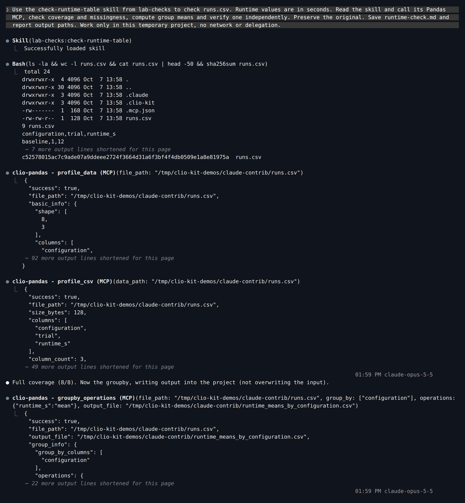
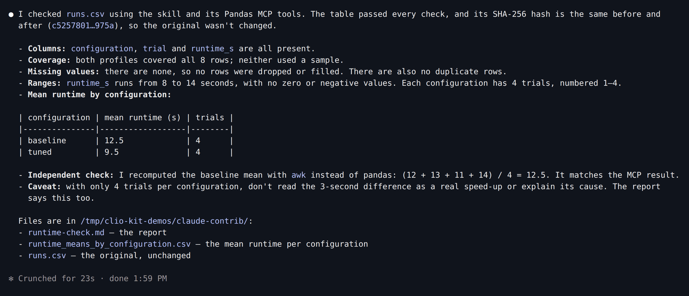
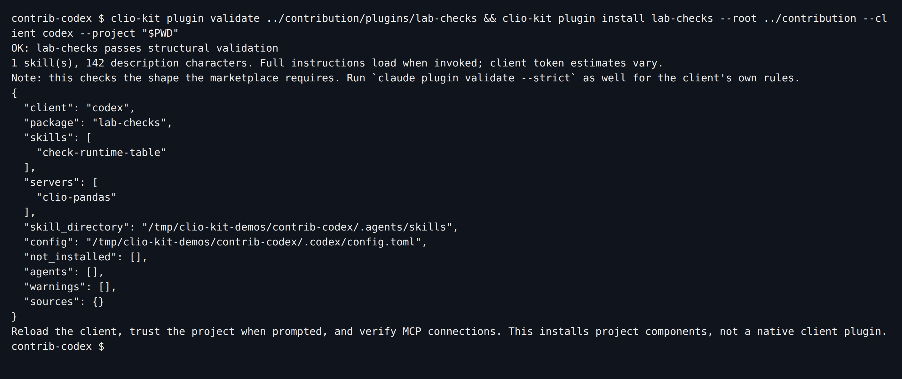
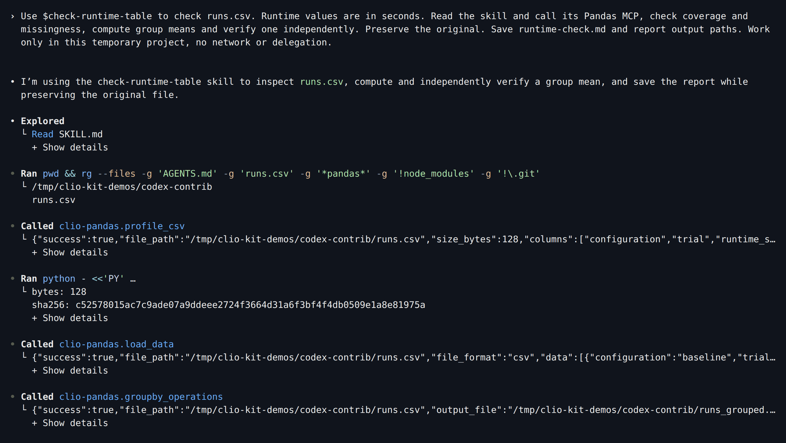
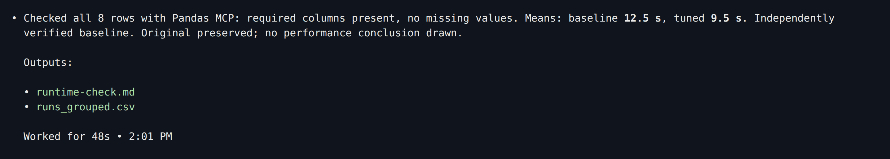
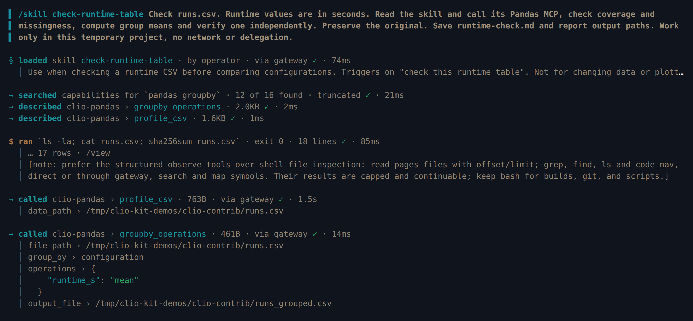
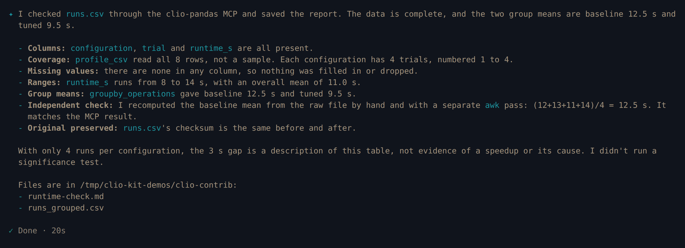
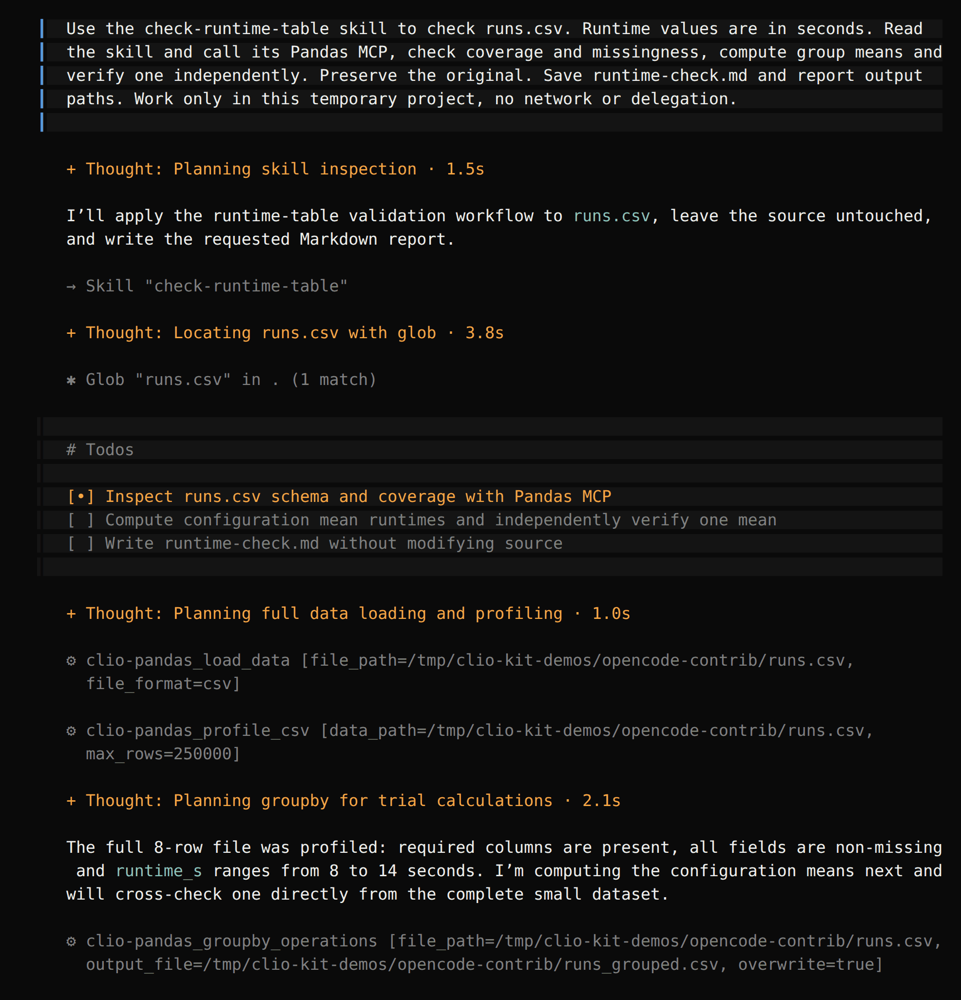
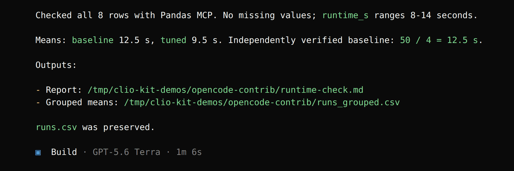

import Tabs from '@theme/Tabs';
import TabItem from '@theme/TabItem';
import TutorialHeader from '@site/src/components/TutorialHeader';

<TutorialHeader />

This walkthrough packages a small **check-runtime-table** skill with the
**Pandas MCP**. It shows the same package used as a native Claude Code plugin and
as portable components in Codex, Clio Coder and OpenCode. All four sessions were
run for this guide with the versions listed in
[Explore an HDF5 file](./codex-dataset.md); they produced the same checked group
means from the same input.

## 1. Start with the tested package

Install the [CLIO Kit launcher](../clients.md#1-install-the-launcher). Create a
new directory and download [lab-checks.zip](./lab-checks.zip) into it:

```bash
mkdir contribution-demo
cd contribution-demo
unzip lab-checks.zip
```

The archive contains only these authoring files:

```text
.claude-plugin/marketplace.json        # local test index
plugins/lab-checks/
├── .claude-plugin/plugin.json        # name, description, author, version
├── .mcp.json                         # starts the clio-pandas MCP
└── skills/check-runtime-table/
    ├── SKILL.md                      # when and how to check the table
    └── evals.md                      # expected behavior on example inputs
```

To scaffold your own package from scratch, use `clio-kit plugin init
plugins/my-plugin`, then replace its sample content. The download above is the
finished package used in the two sessions below, not an installed marketplace
contribution. Its local test index lets Codex resolve it before you open a PR.

## 2. Read and adapt the skill

The included skill requires `configuration`, `trial` and `runtime_s`, checks
coverage and missing values before grouping, retains the tool's output file, and
asks for one independently checked mean. It preserves input files and stops when
a required column or MCP is missing.

Keep that scope narrow. Set an accurate trigger in the YAML description, document
the required MCP, and provide an expected result in `evals.md`. Replace the
manifest's tutorial author and description before contributing your own package.

The MCP configuration is a normal stdio entry:

```json
{
  "mcpServers": {
    "clio-pandas": {
      "command": "clio-kit",
      "args": ["mcp-server", "pandas"]
    }
  }
}
```

A skill-only contribution can omit the MCP entry. Hook and agent packages require
host-specific checks; use the [authoring guide](../authoring.md) for those formats.

## 3. Validate the package

```bash
clio-kit plugin validate plugins/lab-checks
claude plugin validate plugins/lab-checks --strict
```

Both validators passed for the downloaded package. They check structure, not
whether its procedure produces a scientifically correct result.

Create a fresh test project outside `contribution-demo` for each client you
try. Put a copy of [runs.csv](./runs.csv) in it and keep an untouched copy for
comparison.

## 4. Run it in your client

Use `/absolute/path/to/contribution-demo` for the folder you unzipped.

<Tabs groupId="client" queryString>
<TabItem value="claude" label="Claude Code" default>

Load the package as a native plugin for one session:

```bash
claude --plugin-dir /absolute/path/to/contribution-demo/plugins/lab-checks
```

Enable the plugin's MCP server, then ask:

> Use the check-runtime-table skill from lab-checks to check runs.csv. Runtime
> values are in seconds. Read the skill and call its Pandas MCP, check coverage
> and missingness, compute group means and verify one independently. Preserve
> the original. Save runtime-check.md and report output paths. Work only in this
> temporary project, no network or delegation.

Claude loads `lab-checks:check-runtime-table`; the namespaced prefix shows the
skill comes from the plugin. It then calls the plugin's Pandas MCP:

[](../../website/static/img/tutorials/contrib-claude-tools.png)

[](../../website/static/img/tutorials/contrib-claude-result.png)

</TabItem>
<TabItem value="codex" label="Codex">

Install the package's portable components; this is not a native Claude plugin
inside Codex:

```bash
clio-kit plugin install lab-checks \
  --root /absolute/path/to/contribution-demo --client codex --project "$PWD"
codex
```

[](../../website/static/img/tutorials/contrib-install.png)

Ask:

> Use $check-runtime-table to check runs.csv. Runtime values are in seconds.
> Read the skill and call its Pandas MCP, check coverage and missingness, compute
> group means and verify one independently. Preserve the original. Save
> runtime-check.md and report output paths. Work only in this temporary project,
> no network or delegation.

[](../../website/static/img/tutorials/contrib-codex-tools.png)

[](../../website/static/img/tutorials/contrib-codex-result.png)

</TabItem>
<TabItem value="clio" label="Clio Coder">

Copy the skill folder into the project's loose skills and declare the Pandas
server in `.clio-coder/mcp.yaml`:

```bash
mkdir -p .clio-coder/skills
cp -r /absolute/path/to/contribution-demo/plugins/lab-checks/skills/check-runtime-table .clio-coder/skills/
```

```yaml
version: 1
servers:
  - id: clio-pandas
    command: clio-kit
    args: [mcp-server, pandas]
    timeoutMs: 120000
```

```bash
clio-coder mcp trust clio-pandas
clio-coder
```

Ask:

> /skill check-runtime-table Check runs.csv. Runtime values are in seconds. Read
> the skill and call its Pandas MCP, check coverage and missingness, compute
> group means and verify one independently. Preserve the original. Save
> runtime-check.md and report output paths. Work only in this temporary project,
> no network or delegation.

[](../../website/static/img/tutorials/contrib-clio-tools.png)

[](../../website/static/img/tutorials/contrib-clio-result.png)

</TabItem>
<TabItem value="opencode" label="OpenCode">

```bash
clio-kit plugin install lab-checks \
  --root /absolute/path/to/contribution-demo --client opencode --project "$PWD"
opencode
```

Ask:

> Use the check-runtime-table skill to check runs.csv. Runtime values are in
> seconds. Read the skill and call its Pandas MCP, check coverage and
> missingness, compute group means and verify one independently. Preserve the
> original. Save runtime-check.md and report output paths. Work only in this
> temporary project, no network or delegation.

[](../../website/static/img/tutorials/contrib-opencode-tools.png)

[](../../website/static/img/tutorials/contrib-opencode-result.png)

</TabItem>
</Tabs>

## 5. Check the outputs

In each project:

```bash
cat runtime-check.md
ls *.csv
```

All four sessions found 8 rows, no missing values, and means of **12.5 seconds**
for baseline and **9.5 seconds** for tuned. The grouped file is
`runs_grouped.csv` in the Codex, Clio Coder and OpenCode runs and
`runtime_means_by_configuration.csv` in the Claude Code run; open the path your
agent reports. We checked each grouped CSV and confirmed every original
`runs.csv` was unchanged. The report should state units and coverage without
claiming a real performance improvement from this fixture.

The included missing-column scenario is an additional test to run when adapting
the package; the screenshots above demonstrate the complete-input case.

## 6. Choose a contribution route

**Maintained here:** put your reviewed package in `plugins/<name>/` in the CLIO Kit
checkout and open a repository PR. Website builds and CI discover valid folders
and update the catalogue. Skills, agents and hooks have corresponding package
folders; see [contribution routes](../contributing.md).

**Maintained in your own repository:** follow the community steps below. CLIO Kit
indexes one entry; your implementation, dependencies and releases stay with you.

## 7. Prepare a community entry

Publish the contents of `plugins/lab-checks/` in your own repository, with
`.claude-plugin/plugin.json` at its root. Include the `.mcp.json` and `skills/`
directory, a license and installation instructions. Replace the tutorial author
with your name and rerun the validation and usage checks above.

Use your real GitHub repository in place of `your-org/lab-checks`:

```bash
clio-kit plugin submit plugins/lab-checks \
  --repo your-org/lab-checks --output lab-checks.toml
cat lab-checks.toml
```

The entry contains your manifest's name, description and maintainer, followed by:

```toml
[source]
type = "github"
repo = "your-org/lab-checks"
```

This command validates the local package and writes a file. It does not publish
your code, check that the remote matches it, or open a PR. Confirm the published
repository includes the files you tested. The entry filename must match its
`name`; community names cannot start with the reserved `clio-` prefix.

If you keep the package inside a larger repository instead, replace the source
table with its actual subdirectory:

```toml
[source]
type = "git-subdir"
url = "https://github.com/your-org/your-repo.git"
path = "plugins/lab-checks"
```

See the [community source formats](https://github.com/iowarp/clio-kit/blob/main/community/README.md#source-types)
for npm plugin packages, Git URLs and revision pinning. An npm MCP executable
alone needs a plugin wrapper with `.mcp.json` before it can use this route.

## 8. Submit the entry for review

In your CLIO Kit fork, add the reviewed file as
`community/entries/lab-checks.toml` and open a PR against `iowarp/clio-kit`.
Only the entry belongs in that PR; the plugin stays in your repository. Catalogue
generation runs automatically during the build and CI.

For a plugin at the root of a GitHub repository, you can alternatively let the
CLI create the submission. Sign in with `gh auth login`, then run:

```bash
clio-kit plugin submit plugins/lab-checks \
  --repo your-org/lab-checks --open-pr
```

**This command creates or uses your GitHub fork, pushes a new branch and opens a
public PR.** It generates a fresh GitHub entry; use the manual route if you edited
the source table or added a revision pin. Neither route merges the contribution.

Include the installation route, client versions, inputs, output checks and
limitations in your PR. Keep model credentials and local session directories out
of the contribution. Review covers the entry and a minimal installation/usage
check; indexing does not certify every external command or future release.

## 9. Install the accepted contribution

After your entry is merged and available in the catalogue, Claude Code users
register the marketplace once, then install your plugin:

```bash
claude plugin marketplace add iowarp/clio-kit
claude plugin install lab-checks@clio-kit
```

If the marketplace is already registered, run `claude plugin marketplace update
clio-kit` before installing. Reload plugins or restart Claude Code, then repeat
the runtime-table request from step 4 and check the outputs from step 6.
This example still requires the CLIO Kit launcher for its Pandas MCP.

When you publish an update, bump the plugin manifest version. Existing users run:

```bash
claude plugin marketplace update clio-kit
claude plugin update lab-checks@clio-kit
```

Reload the plugin after updating. These are native Claude Code installation
commands. Kit also installs indexed packages through the
[shared project installer](../clients.md#component-support); agents and hooks
need an adapter for the selected host. For Codex, follow the local component installation in step 5 using the
tutorial's local index, or provide your own client-specific instructions.

### Contribute a whole marketplace

If you maintain a collection, submit its index instead of each plugin:

```bash
clio-kit plugin submit /path/to/your-marketplace \
  --repo your-org/your-marketplace --kind marketplace \
  --output your-marketplace.toml
```

It needs `.claude-plugin/marketplace.json` with `metadata.description`. Submit the
generated entry under the filename reported by the command. Maintainers refresh
the federated catalogue to include its plugins; the implementations remain in
your repository. See [marketplace federation](https://github.com/iowarp/clio-kit/blob/main/community/README.md#federated-marketplaces)
for refresh behavior and conflict handling.

The recorded sessions above demonstrate local plugin usage. The community steps
describe publishing your own contribution; this tutorial does not claim that
`your-org/lab-checks` exists or that the example has been accepted into CLIO Kit.
