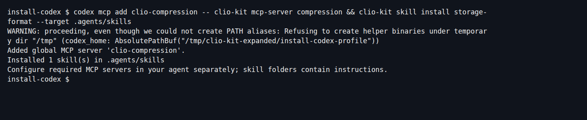
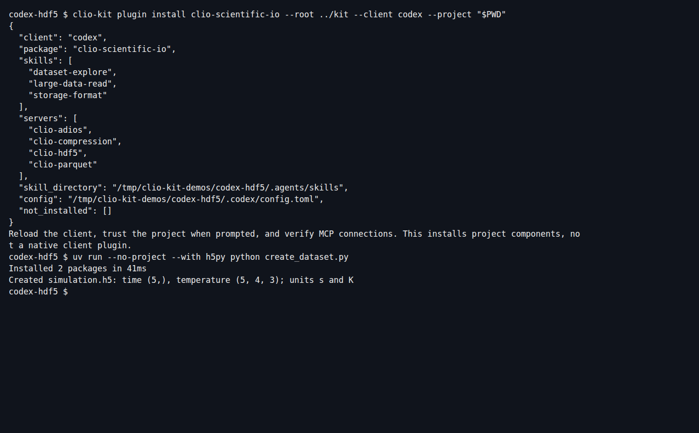
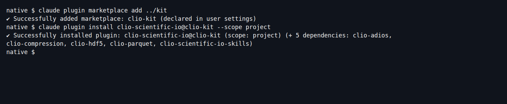

An **MCP server** supplies callable tools. A **skill** supplies instructions.
A **plugin** bundles components for a workflow. Choose the smallest installation
that covers your task, then verify actual use in your agent.

## 1. Install the launcher once

From the source checkout:

```bash
git clone https://github.com/iowarp/clio-kit.git
cd clio-kit
uv tool install --force --reinstall --editable ".[verification]"
clio-kit mcp-servers
```

You need Git, uv, Python 3.10 or newer and the client you intend to use. Keep the
checkout available. If the executable is missing, run `uv tool update-shell` and
reopen the terminal and client. For a release installation without a checkout,
use the [selective installation guide](../installation.md).

## 2. Add one MCP

From your working project, choose **one** client:

```bash
# Codex: registers the server in the user's Codex configuration
codex mcp add clio-compression -- clio-kit mcp-server compression
```

```bash
# Claude Code: writes this project's .mcp.json
claude mcp add --scope project clio-compression -- clio-kit mcp-server compression
```

The launcher prepares the selected server's isolated dependencies on first use.
Registering an MCP is not the same as successfully starting it:

```bash
clio-kit doctor --server compression --connect
```

Then open your client, check `/mcp`, and run a small task such as the
[archive round-trip](./archive-and-summarize.md).

## 3. Add one skill

```bash
# Codex project
clio-kit skill install storage-format --target .agents/skills
```

```bash
# Claude Code project
clio-kit skill install storage-format --target .claude/skills
```

[](../../website/static/img/tutorials/individual-install.png)

Start a fresh session. Request `$storage-format` in Codex or `/storage-format`
in Claude Code. Inspect the skill load/read. This skill gives guidance without
MCP calls; others declare required tools that must be connected separately.

## 4. Install a workflow's components in Codex

```bash
clio-kit plugin install clio-scientific-io \
  --root /path/to/clio-kit --client codex --project /path/to/project
```

This writes project-local MCP configuration and copies the three scientific I/O
skills. Add `--dry-run` first to inspect the plan.

[](../../website/static/img/tutorials/codex-install.png)

The same project installer accepts `--client claude-code`. This route installs
portable components; it does not translate native agents and hooks into every
client. Follow the [Codex HDF5 workflow](./codex-dataset.md) to verify use.

## 5. Install a native plugin in Claude Code

```bash
claude plugin marketplace add /path/to/clio-kit
claude plugin install clio-scientific-io@clio-kit --scope project
claude mcp list
```

[](../../website/static/img/tutorials/native-install.png)

Keep the launcher installed: a manifest starts `clio-kit`; it does not contain
all the runtime dependencies itself. Restart the session, inspect the connected
servers and try the [native storage skill](./choose-storage.md).

Use one route per component to avoid duplicate MCP registrations or skill copies.
For updates, removal, PATH issues and other agents, see [client setup](../clients.md).
For a plugin you authored yourself, continue to [contribution](./contribute-plugin.md).
