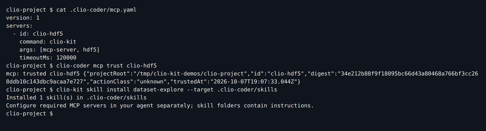
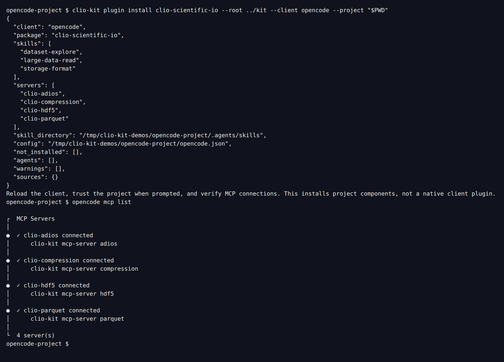

import Tabs from '@theme/Tabs';
import TabItem from '@theme/TabItem';
import TutorialHeader from '@site/src/components/TutorialHeader';

<TutorialHeader />

An **MCP server** supplies callable tools. A **skill** supplies instructions.
A **plugin** bundles components for a workflow. Choose the smallest installation
that covers your task, then verify actual use in your agent.

## 1. Install the launcher once

From the source checkout:

```bash
git clone https://github.com/iowarp/clio-kit.git
cd clio-kit
uv tool install --force --reinstall --editable ".[verification]"
clio-kit mcp-servers
```

You need Git, uv, Python 3.10 or newer and the client you intend to use. Keep the
checkout available. If the executable is missing, run `uv tool update-shell` and
reopen the terminal and client. For a release installation without a checkout,
use the [selective installation guide](../installation.md).

## 2. Add one MCP

Every client starts the same stdio command, `clio-kit mcp-server <name>`; only
the place you declare it differs. From your working project:

<Tabs groupId="client" queryString>
<TabItem value="claude" label="Claude Code" default>

```bash
# Writes this project's .mcp.json
claude mcp add --scope project clio-compression -- clio-kit mcp-server compression
```

</TabItem>
<TabItem value="codex" label="Codex">

```bash
# Registers the server in your user Codex configuration
codex mcp add clio-compression -- clio-kit mcp-server compression
```

For a project-only entry, put the same command in `.codex/config.toml` under
`[mcp_servers.clio-compression]`; Codex reads it once you trust the folder.

</TabItem>
<TabItem value="clio" label="Clio Coder">

Save this as `.clio-coder/mcp.yaml`, then trust it. A project server does not
launch until you do:

```yaml
version: 1
servers:
  - id: clio-compression
    command: clio-kit
    args: [mcp-server, compression]
    timeoutMs: 120000
```

```bash
clio-coder mcp trust clio-compression
```

</TabItem>
<TabItem value="opencode" label="OpenCode">

Add the server to the project's `opencode.json`:

```json
{
  "$schema": "https://opencode.ai/config.json",
  "mcp": {
    "clio-compression": {
      "type": "local",
      "command": ["clio-kit", "mcp-server", "compression"],
      "enabled": true,
      "timeout": 120000
    }
  }
}
```

</TabItem>
</Tabs>

The launcher prepares the selected server's isolated dependencies on first use.
Registering an MCP is not the same as successfully starting it:

```bash
clio-kit doctor --server compression --connect
```

Then open your client, check its MCP list, and run a small task such as the
[archive round-trip](./archive-and-summarize.md).

## 3. Add one skill

A skill is a folder; install it where your client looks for project skills and
invoke it the way your client expects:

| Client | Install target | Invoke |
| --- | --- | --- |
| Claude Code | `.claude/skills` | `/storage-format` |
| Codex | `.agents/skills` | `$storage-format` |
| Clio Coder | `.clio-coder/skills` | `/skill storage-format` |
| OpenCode | `.agents/skills` | "Use the storage-format skill" |

```bash
clio-kit skill install storage-format --target .agents/skills
```

[](../../website/static/img/tutorials/individual-install.png)

Start a fresh session and check that the skill loads. This skill gives guidance
without MCP calls; others declare required tools that must be connected
separately.

## 4. Install a workflow's components

<Tabs groupId="client" queryString>
<TabItem value="claude" label="Claude Code" default>

```bash
clio-kit plugin install clio-scientific-io \
  --root /path/to/clio-kit --client claude-code --project "$PWD"
```

This copies the three scientific I/O skills to `.claude/skills` and writes four
MCP entries to `.mcp.json`. Claude Code can also install the workflow as a
native plugin; see section 5.

</TabItem>
<TabItem value="codex" label="Codex">

```bash
clio-kit plugin install clio-scientific-io \
  --root /path/to/clio-kit --client codex --project "$PWD"
```

This writes project-local MCP configuration and copies the three scientific I/O
skills. Add `--dry-run` first to inspect the plan.

[](../../website/static/img/tutorials/codex-install.png)

</TabItem>
<TabItem value="clio" label="Clio Coder">

Kit has no `--client clio-coder` adapter. Declare the workflow's servers in
`.clio-coder/mcp.yaml`, trust each one, and install its skills into
`.clio-coder/skills`:

[](../../website/static/img/tutorials/clio-install.png)

For a whole workflow, list every server it uses, for example `clio-adios`,
`clio-compression`, `clio-hdf5` and `clio-parquet` for scientific I/O, and
install `dataset-explore`, `large-data-read` and `storage-format`.

</TabItem>
<TabItem value="opencode" label="OpenCode">

```bash
clio-kit plugin install clio-scientific-io \
  --root /path/to/clio-kit --client opencode --project "$PWD"
opencode mcp list
```

The installer writes local MCP entries to `opencode.json` and copies the skills
to `.agents/skills`. `opencode mcp list` confirms each server connects:

[](../../website/static/img/tutorials/opencode-install.png)

</TabItem>
</Tabs>

This route installs portable components; it does not translate native agents and
hooks into every client. Follow the [HDF5 workflow](./codex-dataset.md) to
verify use in your client.

## 5. Install a native plugin in Claude Code

```bash
claude plugin marketplace add /path/to/clio-kit
claude plugin install clio-scientific-io@clio-kit --scope project
claude mcp list
```

[](../../website/static/img/tutorials/native-install.png)

Keep the launcher installed: a manifest starts `clio-kit`; it does not contain
all the runtime dependencies itself. Restart the session, inspect the connected
servers and try the [storage skill](./choose-storage.md).

Use one route per component to avoid duplicate MCP registrations or skill copies.
For updates, removal, PATH issues and other agents, see [client setup](../clients.md).
For a plugin you authored yourself, continue to [contribution](./contribute-plugin.md).
